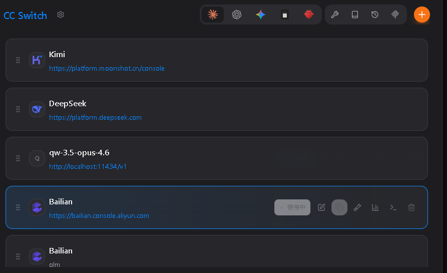

# 使用 springboot3.5 基于jdk21替换fastAPI 

 git clone https://github.com/woyao-cloud/ollama-03-02-test-claude-prompt01.git

# step-1
>作为架构师，计划使用java springboot3.5 基于jdk21替换fastAPI 作为后端，需要规划一下调整当前的提示器文件

● 我明白了，你需要将后端从 FastAPI 迁移到 Spring Boot 3.5 (JDK 21)。让我先探索当前项目结构，然后规划需要的调整。

● 2 Explore agents finished (ctrl+o to expand)
   ├─ 探索项目结构和文档 · 0 tool uses
   │  ⎿  Done
   └─ 分析现有技术文档 · 0 tool uses
      ⎿  Done

● 让我直接使用文件工具探索项目结构。

  Searched for 1 pattern, read 11 files (ctrl+o to expand)

● 现在我已经全面了解了项目文档。让我创建一个详细的计划，用于将后端从 FastAPI 迁移到 Spring Boot 3.5 (JDK 21)。

● Updated plan
  ⎿  /plan to preview

● User approved Claude's plan
  ⎿  Plan saved to: C:\Users\laido\.claude\plans\greedy-growing-pixel.md · /plan to edit
     后端迁移计划: FastAPI → Spring Boot 3.5

     背景与目标

     将全栈用户管理系统的后端技术栈从 FastAPI + Python 3.11 迁移到 Spring Boot 3.5 + JDK 21，同时保持前端 Next.js
     不变，确保 API 契约兼容。

     动机:
     - 利用 JDK 21 的虚拟线程和性能改进
     - 企业级生态系统和长期支持
     - 更成熟的微服务工具链

     ---
     技术栈映射

     ┌──────────────────┬──────────────────────────────┬─────────────────────────────┐
     │ 原技术 (FastAPI) │     新技术 (Spring Boot)     │            说明             │
     ├──────────────────┼──────────────────────────────┼─────────────────────────────┤
     │ Python 3.11      │ JDK 21                       │ 虚拟线程、模式匹配、Records │
     ├──────────────────┼──────────────────────────────┼─────────────────────────────┤
     │ FastAPI 0.104    │ Spring Boot 3.5              │ 嵌入式 Tomcat/WebFlux       │
     ├──────────────────┼──────────────────────────────┼─────────────────────────────┤
     │ SQLAlchemy 2.0   │ Spring Data JPA (Hibernate)  │ 对象关系映射                │
     ├──────────────────┼──────────────────────────────┼─────────────────────────────┤
     │ Alembic          │ Flyway                       │ 数据库迁移管理              │
     ├──────────────────┼──────────────────────────────┼─────────────────────────────┤
     │ Pydantic         │ Jakarta Validation + Records │ 数据验证和DTO               │
     ├──────────────────┼──────────────────────────────┼─────────────────────────────┤
     │ Python-Jose      │ Spring Security + Nimbus JWT │ JWT 处理                    │
     ├──────────────────┼──────────────────────────────┼─────────────────────────────┤
     │ Passlib (Argon2) │ Spring Security Crypto       │ 密码哈希                    │
     ├──────────────────┼──────────────────────────────┼─────────────────────────────┤
     │ pytest           │ JUnit 5 + Testcontainers     │ 测试框架                    │
     ├──────────────────┼──────────────────────────────┼─────────────────────────────┤
     │ Black/Ruff/Mypy  │ Checkstyle/SpotBugs          │ 代码质量                    │
     ├──────────────────┼──────────────────────────────┼─────────────────────────────┤
     │ Uvicorn          │ 嵌入式 Tomcat (默认)         │ 应用服务器                  │
     └──────────────────┴──────────────────────────────┴─────────────────────────────┘

     ---
     需要更新的文档文件

     1. CLAUDE.md (主项目配置)

     修改内容:
     - 更新技术栈描述 (后端部分)
     - 更新项目结构示例
     - 更新开发原则 (Python 类型提示 → Java 类型系统)
     - 更新质量指标 (Python 覆盖率 → Java 覆盖率)

     2. BACKEND_ARCHITECTURE.md (后端架构)

     修改内容:
     - 完全重写技术栈章节
     - 更新项目结构 (Spring Boot 标准结构)
     - 更新分层架构描述
     - 更新安全和性能设计 (Spring Security 配置)

     3. DATABASE_SCHEMA.md (数据库设计)

     修改内容:
     - 迁移工具改为 Flyway
     - 更新 SQL 方言说明 (PostgreSQL 不变)
     - 添加 JPA 实体映射说明

     4. AGENTS.md (多代理协作)

     修改内容:
     - 更新后端工程师角色描述 (FastAPI → Spring Boot)
     - 更新各代理的技术栈引用

     5. TESTING_STRATEGY.md (测试策略)

     修改内容:
     - 更新测试工具和框架
     - 更新覆盖率工具 (JaCoCo)
     - 更新测试金字塔比例说明

     6. DEVELOPMENT_WORKFLOW.md (开发流程)

     修改内容:
     - 更新质量门禁命令 (Maven/Gradle)
     - 更新提交规范示例

     7. DEPLOYMENT_GUIDE.md (部署指南)

     修改内容:
     - 更新容器配置 (JVM 内存设置)
     - 更新 CI/CD 流程 (Maven 构建)

     8. PLAN.md (实施计划)

     修改内容:
     - 完全重写为 Spring Boot 实施计划
     - 更新项目结构和文件清单
     - 更新依赖关系和里程碑

     ---
     Spring Boot 项目结构

     backend/
     ├── src/
     │   ├── main/
     │   │   ├── java/com/usermanagement/
     │   │   │   ├── Application.java          # 应用入口
     │   │   │   ├── config/                    # 配置类
     │   │   │   │   ├── SecurityConfig.java
     │   │   │   │   ├── JwtConfig.java
     │   │   │   │   └── DatabaseConfig.java
     │   │   │   ├── domain/                    # 领域模型 (JPA 实体)
     │   │   │   │   ├── user/
     │   │   │   │   │   ├── User.java
     │   │   │   │   │   ├── Role.java
     │   │   │   │   │   └── Permission.java
     │   │   │   │   └── audit/
     │   │   │   │       ├── AuditLog.java
     │   │   │   │       └── UserSession.java
     │   │   │   ├── repository/                # Spring Data 仓库
     │   │   │   │   ├── UserRepository.java
     │   │   │   │   ├── RoleRepository.java
     │   │   │   │   └── PermissionRepository.java
     │   │   │   ├── service/                   # 业务服务层
     │   │   │   │   ├── UserService.java
     │   │   │   │   ├── AuthService.java
     │   │   │   │   └── JwtService.java
     │   │   │   ├── security/                  # 安全相关
     │   │   │   │   ├── JwtAuthenticationFilter.java
     │   │   │   │   ├── JwtTokenProvider.java
     │   │   │   │   └── UserDetailsServiceImpl.java
     │   │   │   ├── web/                       # Web 层 (Controller)
     │   │   │   │   ├── controller/
     │   │   │   │   │   ├── AuthController.java
     │   │   │   │   │   ├── UserController.java
     │   │   │   │   │   └── RoleController.java
     │   │   │   │   ├── dto/                   # DTO/Records
     │   │   │   │   │   ├── UserDTO.java
     │   │   │   │   │   ├── LoginRequest.java
     │   │   │   │   │   └── TokenResponse.java
     │   │   │   │   └── exception/             # 全局异常处理
     │   │   │   └── infrastructure/            # 基础设施
     │   │   └── resources/
     │   │       ├── application.yml            # 主配置
     │   │       ├── application-dev.yml        # 开发环境
     │   │       ├── application-prod.yml       # 生产环境
     │   │       └── db/migration/              # Flyway 迁移脚本
     │   │           ├── V1__Initial_schema.sql
     │   │           └── V2__Add_audit_tables.sql
     │   └── test/
     │       ├── java/com/usermanagement/       # 测试类
     │       │   ├── unit/
     │       │   └── integration/
     │       └── resources/
     │           └── application-test.yml
     ├── pom.xml (或 build.gradle)              # Maven/Gradle 配置
     ├── Dockerfile                             # 容器化
     └── docker-compose.yml

     ---
     关键依赖配置 (pom.xml)

     <!-- Spring Boot 3.5 + JDK 21 -->
     <parent>
         <groupId>org.springframework.boot</groupId>
         <artifactId>spring-boot-starter-parent</artifactId>
         <version>3.5.0</version>
     </parent>

     <properties>
         <java.version>21</java.version>
         <spring-boot.version>3.5.0</spring-boot.version>
     </properties>

     <dependencies>
         <!-- Web -->
         <dependency>
             <groupId>org.springframework.boot</groupId>
             <artifactId>spring-boot-starter-web</artifactId>
         </dependency>

         <!-- Security -->
         <dependency>
             <groupId>org.springframework.boot</groupId>
             <artifactId>spring-boot-starter-security</artifactId>
         </dependency>
         <dependency>
             <groupId>org.springframework.boot</groupId>
             <artifactId>spring-boot-starter-oauth2-resource-server</artifactId>
         </dependency>

         <!-- JPA + Database -->
         <dependency>
             <groupId>org.springframework.boot</groupId>
             <artifactId>spring-boot-starter-data-jpa</artifactId>
         </dependency>
         <dependency>
             <groupId>org.postgresql</groupId>
             <artifactId>postgresql</artifactId>
         </dependency>
         <dependency>
             <groupId>org.flywaydb</groupId>
             <artifactId>flyway-core</artifactId>
         </dependency>

         <!-- JWT -->
         <dependency>
             <groupId>org.springframework.security</groupId>
             <artifactId>spring-security-oauth2-jose</artifactId>
         </dependency>

         <!-- Validation -->
         <dependency>
             <groupId>org.springframework.boot</groupId>
             <artifactId>spring-boot-starter-validation</artifactId>
         </dependency>

         <!-- Testing -->
         <dependency>
             <groupId>org.springframework.boot</groupId>
             <artifactId>spring-boot-starter-test</artifactId>
             <scope>test</scope>
         </dependency>
         <dependency>
             <groupId>org.testcontainers</groupId>
             <artifactId>junit-jupiter</artifactId>
             <scope>test</scope>
         </dependency>
         <dependency>
             <groupId>org.testcontainers</groupId>
             <artifactId>postgresql</artifactId>
             <scope>test</scope>
         </dependency>
     </dependencies>

     ---
     API 兼容性保证

     不变的部分:
     - API 端点路径 (保持 /api/v1/* 格式)
     - 请求/响应 JSON 结构 (与前端契约一致)
     - HTTP 状态码
     - JWT 令牌格式和有效期
     - RBAC 权限模型

     需要关注的差异:
     - 验证错误响应格式 (Spring Boot 默认 vs FastAPI)
     - 分页参数处理 (Spring Data Pageable)
     - CORS 配置方式

     ---
     实施阶段

     阶段 1: 文档更新 (本计划)

     1. 更新所有技术文档，反映 Spring Boot 技术栈
     2. 更新代理配置 (AGENTS.md)
     3. 更新开发和部署流程文档

     阶段 2: 项目脚手架

     1. 创建 Spring Boot 项目结构
     2. 配置 Maven/Gradle 构建
     3. 设置多环境配置文件
     4. 配置 Docker 和 docker-compose

     阶段 3: 数据库层

     1. 创建 JPA 实体 (User, Role, Permission)
     2. 创建 Spring Data Repository 接口
     3. 编写 Flyway 迁移脚本 (从现有 SQLAlchemy 模型转换)

     阶段 4: 安全层

     1. 配置 Spring Security
     2. 实现 JWT 令牌提供者
     3. 实现 JWT 过滤器
     4. 配置 RBAC 权限表达式

     阶段 5: 业务服务层

     1. 实现 UserService
     2. 实现 AuthService
     3. 实现 Role/Permission Service

     阶段 6: API 控制器

     1. 实现 AuthController (登录/注册/刷新)
     2. 实现 UserController (CRUD)
     3. 实现 RoleController
     4. 全局异常处理

     阶段 7: 测试

     1. 单元测试 (JUnit 5, Mockito)
     2. 集成测试 (Testcontainers)
     3. API 契约测试
     4. 覆盖率检查 (JaCoCo)

     阶段 8: 集成验证

     1. 前后端联调
     2. API 兼容性验证
     3. 性能基准测试

     ---
     风险与缓解

     ┌──────────────────────────┬──────┬─────────────────────────────────────┐
     │           风险           │ 影响 │              缓解措施               │
     ├──────────────────────────┼──────┼─────────────────────────────────────┤
     │ API 契约变化导致前端问题 │ 高   │ 严格保持 DTO 结构一致，添加契约测试 │
     ├──────────────────────────┼──────┼─────────────────────────────────────┤
     │ 认证流程差异             │ 高   │ 详细测试 JWT 生成/验证流程          │
     ├──────────────────────────┼──────┼─────────────────────────────────────┤
     │ 性能回退                 │ 中   │ JVM 调优，对比基准测试              │
     ├──────────────────────────┼──────┼─────────────────────────────────────┤
     │ 学习曲线                 │ 低   │ 团队熟悉 Spring 生态                │
     ├──────────────────────────┼──────┼─────────────────────────────────────┤
     │ 数据库迁移兼容性         │ 中   │ Flyway 与 Alembic 迁移对齐          │
     └──────────────────────────┴──────┴─────────────────────────────────────┘

     ---
     文件修改清单

     ┌─────────────────────────┬──────────────┬────────┐
     │          文件           │   修改类型   │ 优先级 │
     ├─────────────────────────┼──────────────┼────────┤
     │ CLAUDE.md               │ 更新技术栈   │ P0     │
     ├─────────────────────────┼──────────────┼────────┤
     │ BACKEND_ARCHITECTURE.md │ 完全重写     │ P0     │
     ├─────────────────────────┼──────────────┼────────┤
     │ AGENTS.md               │ 更新角色描述 │ P0     │
     ├─────────────────────────┼──────────────┼────────┤
     │ DATABASE_SCHEMA.md      │ 更新迁移工具 │ P1     │
     ├─────────────────────────┼──────────────┼────────┤
     │ TESTING_STRATEGY.md     │ 更新测试工具 │ P1     │
     ├─────────────────────────┼──────────────┼────────┤
     │ DEVELOPMENT_WORKFLOW.md │ 更新质量门禁 │ P1     │
     ├─────────────────────────┼──────────────┼────────┤
     │ DEPLOYMENT_GUIDE.md     │ 更新部署配置 │ P1     │
     ├─────────────────────────┼──────────────┼────────┤
     │ PLAN.md                 │ 完全重写     │ P0     │
     └─────────────────────────┴──────────────┴────────┘

     ---
     验证标准

     - 所有文档已更新，技术栈描述准确
     - API 端点与原有 FastAPI 设计兼容
     - 测试覆盖率 ≥ 85%
     - 认证/授权流程功能一致
     - 前端无需修改即可正常调用

● 计划已获批准。现在开始更新文档文件。我将首先更新 P0 优先级的文档。

· Vibing… (2m 51s · ↑ 3.6k tokens · thought for 2s)
  ⎿  □ 重写 BACKEND_ARCHITECTURE.md
     □ 更新 CLAUDE.md 技术栈
     □ 重写 PLAN.md 实施计划
     □ 更新 AGENTS.md 角色描述

────────────────────────────────────────────────────────────────────────────────────────────────────────────────────────
> 
────────────────────────────────────────────────────────────────────────────────────────────────────────────────────────
  ⏵⏵ bypass permissions on (shift+tab to cycle) · esc to interrupt · ctrl+t to hide tasks
 ▐▛███▜▌   Claude Code v2.1.81
▝▜█████▛▘  kimi-k2.5 · API Usage Billing
  ▘▘ ▝▝    D:\claude-code-project\agentic-projects\ollama-03-02

> start

● 我来帮你启动这个全栈用户管理系统项目。首先让我查看当前的项目结构。

  Searched for 1 pattern, read 1 file (ctrl+o to expand)

● Bash(pwd && ls -la)
  ⎿  (No output)
  ⎿  Interrupted · What should Claude do instead?

> /plan
  ⎿  Enabled plan mode

> 作为架构师，计划使用java springboot3.5 基于jdk21替换fastAPI 作为后端，需要规划一下调整当前的提示器文件

● 我明白了，你需要将后端从 FastAPI 迁移到 Spring Boot 3.5 (JDK 21)。让我先探索当前项目结构，然后规划需要的调整。

● 2 Explore agents finished (ctrl+o to expand)
   ├─ 探索项目结构和文档 · 0 tool uses
   │  ⎿  Done
   └─ 分析现有技术文档 · 0 tool uses
      ⎿  Done

● 让我直接使用文件工具探索项目结构。

  Searched for 1 pattern, read 11 files (ctrl+o to expand)

● 现在我已经全面了解了项目文档。让我创建一个详细的计划，用于将后端从 FastAPI 迁移到 Spring Boot 3.5 (JDK 21)。

● Updated plan
  ⎿  /plan to preview

● User approved Claude's plan
  ⎿  Plan saved to: C:\Users\laido\.claude\plans\greedy-growing-pixel.md · /plan to edit
     后端迁移计划: FastAPI → Spring Boot 3.5

     背景与目标

     将全栈用户管理系统的后端技术栈从 FastAPI + Python 3.11 迁移到 Spring Boot 3.5 + JDK 21，同时保持前端 Next.js 不变，确保 API 契约兼容。

     动机:
     - 利用 JDK 21 的虚拟线程和性能改进
     - 企业级生态系统和长期支持
     - 更成熟的微服务工具链

     ---
     技术栈映射

     ┌──────────────────┬──────────────────────────────┬─────────────────────────────┐
     │ 原技术 (FastAPI) │     新技术 (Spring Boot)     │            说明             │
     ├──────────────────┼──────────────────────────────┼─────────────────────────────┤
     │ Python 3.11      │ JDK 21                       │ 虚拟线程、模式匹配、Records │
     ├──────────────────┼──────────────────────────────┼─────────────────────────────┤
     │ FastAPI 0.104    │ Spring Boot 3.5              │ 嵌入式 Tomcat/WebFlux       │
     ├──────────────────┼──────────────────────────────┼─────────────────────────────┤
     │ SQLAlchemy 2.0   │ Spring Data JPA (Hibernate)  │ 对象关系映射                │
     ├──────────────────┼──────────────────────────────┼─────────────────────────────┤
     │ Alembic          │ Flyway                       │ 数据库迁移管理              │
     ├──────────────────┼──────────────────────────────┼─────────────────────────────┤
     │ Pydantic         │ Jakarta Validation + Records │ 数据验证和DTO               │
     ├──────────────────┼──────────────────────────────┼─────────────────────────────┤
     │ Python-Jose      │ Spring Security + Nimbus JWT │ JWT 处理                    │
     ├──────────────────┼──────────────────────────────┼─────────────────────────────┤
     │ Passlib (Argon2) │ Spring Security Crypto       │ 密码哈希                    │
     ├──────────────────┼──────────────────────────────┼─────────────────────────────┤
     │ pytest           │ JUnit 5 + Testcontainers     │ 测试框架                    │
     ├──────────────────┼──────────────────────────────┼─────────────────────────────┤
     │ Black/Ruff/Mypy  │ Checkstyle/SpotBugs          │ 代码质量                    │
     ├──────────────────┼──────────────────────────────┼─────────────────────────────┤
     │ Uvicorn          │ 嵌入式 Tomcat (默认)         │ 应用服务器                  │
     └──────────────────┴──────────────────────────────┴─────────────────────────────┘

     ---
     需要更新的文档文件

     1. CLAUDE.md (主项目配置)

     修改内容:
     - 更新技术栈描述 (后端部分)
     - 更新项目结构示例
     - 更新开发原则 (Python 类型提示 → Java 类型系统)
     - 更新质量指标 (Python 覆盖率 → Java 覆盖率)

     2. BACKEND_ARCHITECTURE.md (后端架构)

     修改内容:
     - 完全重写技术栈章节
     - 更新项目结构 (Spring Boot 标准结构)
     - 更新分层架构描述
     - 更新安全和性能设计 (Spring Security 配置)

     3. DATABASE_SCHEMA.md (数据库设计)

     修改内容:
     - 迁移工具改为 Flyway
     - 更新 SQL 方言说明 (PostgreSQL 不变)
     - 添加 JPA 实体映射说明

     4. AGENTS.md (多代理协作)

     修改内容:
     - 更新后端工程师角色描述 (FastAPI → Spring Boot)
     - 更新各代理的技术栈引用

     5. TESTING_STRATEGY.md (测试策略)

     修改内容:
     - 更新测试工具和框架
     - 更新覆盖率工具 (JaCoCo)
     - 更新测试金字塔比例说明

     6. DEVELOPMENT_WORKFLOW.md (开发流程)

     修改内容:
     - 更新质量门禁命令 (Maven/Gradle)
     - 更新提交规范示例

     7. DEPLOYMENT_GUIDE.md (部署指南)

     修改内容:
     - 更新容器配置 (JVM 内存设置)
     - 更新 CI/CD 流程 (Maven 构建)

     8. PLAN.md (实施计划)

     修改内容:
     - 完全重写为 Spring Boot 实施计划
     - 更新项目结构和文件清单
     - 更新依赖关系和里程碑

     ---
     Spring Boot 项目结构

     backend/
     ├── src/
     │   ├── main/
     │   │   ├── java/com/usermanagement/
     │   │   │   ├── Application.java          # 应用入口
     │   │   │   ├── config/                    # 配置类
     │   │   │   │   ├── SecurityConfig.java
     │   │   │   │   ├── JwtConfig.java
     │   │   │   │   └── DatabaseConfig.java
     │   │   │   ├── domain/                    # 领域模型 (JPA 实体)
     │   │   │   │   ├── user/
     │   │   │   │   │   ├── User.java
     │   │   │   │   │   ├── Role.java
     │   │   │   │   │   └── Permission.java
     │   │   │   │   └── audit/
     │   │   │   │       ├── AuditLog.java
     │   │   │   │       └── UserSession.java
     │   │   │   ├── repository/                # Spring Data 仓库
     │   │   │   │   ├── UserRepository.java
     │   │   │   │   ├── RoleRepository.java
     │   │   │   │   └── PermissionRepository.java
     │   │   │   ├── service/                   # 业务服务层
     │   │   │   │   ├── UserService.java
     │   │   │   │   ├── AuthService.java
     │   │   │   │   └── JwtService.java
     │   │   │   ├── security/                  # 安全相关
     │   │   │   │   ├── JwtAuthenticationFilter.java
     │   │   │   │   ├── JwtTokenProvider.java
     │   │   │   │   └── UserDetailsServiceImpl.java
     │   │   │   ├── web/                       # Web 层 (Controller)
     │   │   │   │   ├── controller/
     │   │   │   │   │   ├── AuthController.java
     │   │   │   │   │   ├── UserController.java
     │   │   │   │   │   └── RoleController.java
     │   │   │   │   ├── dto/                   # DTO/Records
     │   │   │   │   │   ├── UserDTO.java
     │   │   │   │   │   ├── LoginRequest.java
     │   │   │   │   │   └── TokenResponse.java
     │   │   │   │   └── exception/             # 全局异常处理
     │   │   │   └── infrastructure/            # 基础设施
     │   │   └── resources/
     │   │       ├── application.yml            # 主配置
     │   │       ├── application-dev.yml        # 开发环境
     │   │       ├── application-prod.yml       # 生产环境
     │   │       └── db/migration/              # Flyway 迁移脚本
     │   │           ├── V1__Initial_schema.sql
     │   │           └── V2__Add_audit_tables.sql
     │   └── test/
     │       ├── java/com/usermanagement/       # 测试类
     │       │   ├── unit/
     │       │   └── integration/
     │       └── resources/
     │           └── application-test.yml
     ├── pom.xml (或 build.gradle)              # Maven/Gradle 配置
     ├── Dockerfile                             # 容器化
     └── docker-compose.yml

     ---
     关键依赖配置 (pom.xml)

     <!-- Spring Boot 3.5 + JDK 21 -->
     <parent>
         <groupId>org.springframework.boot</groupId>
         <artifactId>spring-boot-starter-parent</artifactId>
         <version>3.5.0</version>
     </parent>

     <properties>
         <java.version>21</java.version>
         <spring-boot.version>3.5.0</spring-boot.version>
     </properties>

     <dependencies>
         <!-- Web -->
         <dependency>
             <groupId>org.springframework.boot</groupId>
             <artifactId>spring-boot-starter-web</artifactId>
         </dependency>

         <!-- Security -->
         <dependency>
             <groupId>org.springframework.boot</groupId>
             <artifactId>spring-boot-starter-security</artifactId>
         </dependency>
         <dependency>
             <groupId>org.springframework.boot</groupId>
             <artifactId>spring-boot-starter-oauth2-resource-server</artifactId>
         </dependency>

         <!-- JPA + Database -->
         <dependency>
             <groupId>org.springframework.boot</groupId>
             <artifactId>spring-boot-starter-data-jpa</artifactId>
         </dependency>
         <dependency>
             <groupId>org.postgresql</groupId>
             <artifactId>postgresql</artifactId>
         </dependency>
         <dependency>
             <groupId>org.flywaydb</groupId>
             <artifactId>flyway-core</artifactId>
         </dependency>

         <!-- JWT -->
         <dependency>
             <groupId>org.springframework.security</groupId>
             <artifactId>spring-security-oauth2-jose</artifactId>
         </dependency>

         <!-- Validation -->
         <dependency>
             <groupId>org.springframework.boot</groupId>
             <artifactId>spring-boot-starter-validation</artifactId>
         </dependency>

         <!-- Testing -->
         <dependency>
             <groupId>org.springframework.boot</groupId>
             <artifactId>spring-boot-starter-test</artifactId>
             <scope>test</scope>
         </dependency>
         <dependency>
             <groupId>org.testcontainers</groupId>
             <artifactId>junit-jupiter</artifactId>
             <scope>test</scope>
         </dependency>
         <dependency>
             <groupId>org.testcontainers</groupId>
             <artifactId>postgresql</artifactId>
             <scope>test</scope>
         </dependency>
     </dependencies>

     ---
     API 兼容性保证

     不变的部分:
     - API 端点路径 (保持 /api/v1/* 格式)
     - 请求/响应 JSON 结构 (与前端契约一致)
     - HTTP 状态码
     - JWT 令牌格式和有效期
     - RBAC 权限模型

     需要关注的差异:
     - 验证错误响应格式 (Spring Boot 默认 vs FastAPI)
     - 分页参数处理 (Spring Data Pageable)
     - CORS 配置方式

     ---
     实施阶段

     阶段 1: 文档更新 (本计划)

     1. 更新所有技术文档，反映 Spring Boot 技术栈
     2. 更新代理配置 (AGENTS.md)
     3. 更新开发和部署流程文档

     阶段 2: 项目脚手架

     1. 创建 Spring Boot 项目结构
     2. 配置 Maven/Gradle 构建
     3. 设置多环境配置文件
     4. 配置 Docker 和 docker-compose

     阶段 3: 数据库层

     1. 创建 JPA 实体 (User, Role, Permission)
     2. 创建 Spring Data Repository 接口
     3. 编写 Flyway 迁移脚本 (从现有 SQLAlchemy 模型转换)

     阶段 4: 安全层

     1. 配置 Spring Security
     2. 实现 JWT 令牌提供者
     3. 实现 JWT 过滤器
     4. 配置 RBAC 权限表达式

     阶段 5: 业务服务层

     1. 实现 UserService
     2. 实现 AuthService
     3. 实现 Role/Permission Service

     阶段 6: API 控制器

     1. 实现 AuthController (登录/注册/刷新)
     2. 实现 UserController (CRUD)
     3. 实现 RoleController
     4. 全局异常处理

     阶段 7: 测试

     1. 单元测试 (JUnit 5, Mockito)
     2. 集成测试 (Testcontainers)
     3. API 契约测试
     4. 覆盖率检查 (JaCoCo)

     阶段 8: 集成验证

     1. 前后端联调
     2. API 兼容性验证
     3. 性能基准测试

     ---
     风险与缓解

     ┌──────────────────────────┬──────┬─────────────────────────────────────┐
     │           风险           │ 影响 │              缓解措施               │
     ├──────────────────────────┼──────┼─────────────────────────────────────┤
     │ API 契约变化导致前端问题 │ 高   │ 严格保持 DTO 结构一致，添加契约测试 │
     ├──────────────────────────┼──────┼─────────────────────────────────────┤
     │ 认证流程差异             │ 高   │ 详细测试 JWT 生成/验证流程          │
     ├──────────────────────────┼──────┼─────────────────────────────────────┤
     │ 性能回退                 │ 中   │ JVM 调优，对比基准测试              │
     ├──────────────────────────┼──────┼─────────────────────────────────────┤
     │ 学习曲线                 │ 低   │ 团队熟悉 Spring 生态                │
     ├──────────────────────────┼──────┼─────────────────────────────────────┤
     │ 数据库迁移兼容性         │ 中   │ Flyway 与 Alembic 迁移对齐          │
     └──────────────────────────┴──────┴─────────────────────────────────────┘

     ---
     文件修改清单

     ┌─────────────────────────┬──────────────┬────────┐
     │          文件           │   修改类型   │ 优先级 │
     ├─────────────────────────┼──────────────┼────────┤
     │ CLAUDE.md               │ 更新技术栈   │ P0     │
     ├─────────────────────────┼──────────────┼────────┤
     │ BACKEND_ARCHITECTURE.md │ 完全重写     │ P0     │
     ├─────────────────────────┼──────────────┼────────┤
     │ AGENTS.md               │ 更新角色描述 │ P0     │
     ├─────────────────────────┼──────────────┼────────┤
     │ DATABASE_SCHEMA.md      │ 更新迁移工具 │ P1     │
     ├─────────────────────────┼──────────────┼────────┤
     │ TESTING_STRATEGY.md     │ 更新测试工具 │ P1     │
     ├─────────────────────────┼──────────────┼────────┤
     │ DEVELOPMENT_WORKFLOW.md │ 更新质量门禁 │ P1     │
     ├─────────────────────────┼──────────────┼────────┤
     │ DEPLOYMENT_GUIDE.md     │ 更新部署配置 │ P1     │
     ├─────────────────────────┼──────────────┼────────┤
     │ PLAN.md                 │ 完全重写     │ P0     │
     └─────────────────────────┴──────────────┴────────┘

     ---
     验证标准

     - 所有文档已更新，技术栈描述准确
     - API 端点与原有 FastAPI 设计兼容
     - 测试覆盖率 ≥ 85%
     - 认证/授权流程功能一致
     - 前端无需修改即可正常调用

● 计划已获批准。现在开始更新文档文件。我将首先更新 P0 优先级的文档。


# ● 所有文档更新完成。以下是修改摘要：

  文档更新完成

  P0 优先级 (已完成)

  ┌─────────────────────────┬───────────────────────────────────────────────────────────────┐
  │          文件           │                           修改内容                            │
  ├─────────────────────────┼───────────────────────────────────────────────────────────────┤
  │ CLAUDE.md               │ 技术栈改为 Spring Boot 3.5 + JDK 21，更新项目结构示例         │
  ├─────────────────────────┼───────────────────────────────────────────────────────────────┤
  │ BACKEND_ARCHITECTURE.md │ 完全重写为 Spring Boot 架构，包含分层架构、安全设计、项目结构 │
  ├─────────────────────────┼───────────────────────────────────────────────────────────────┤
  │ AGENTS.md               │ 更新后端工程师角色描述为 Spring Boot                          │
  ├─────────────────────────┼───────────────────────────────────────────────────────────────┤
  │ PLAN.md                 │ 完全重写为 Spring Boot 实施计划，包含 Maven 配置、依赖关系    │
  └─────────────────────────┴───────────────────────────────────────────────────────────────┘

  P1 优先级 (已完成)

  ┌─────────────────────────┬─────────────────────────────────────────────────────┐
  │          文件           │                      修改内容                       │
  ├─────────────────────────┼─────────────────────────────────────────────────────┤
  │ DATABASE_SCHEMA.md      │ Alembic → Flyway，添加 JPA 实体映射说明             │
  ├─────────────────────────┼─────────────────────────────────────────────────────┤
  │ TESTING_STRATEGY.md     │ pytest → JUnit 5 + Testcontainers + JaCoCo          │
  ├─────────────────────────┼─────────────────────────────────────────────────────┤
  │ DEVELOPMENT_WORKFLOW.md │ Python 工具 → Maven 质量门禁                        │
  ├─────────────────────────┼─────────────────────────────────────────────────────┤
  │ DEPLOYMENT_GUIDE.md     │ 添加 JVM 配置、Spring Boot 容器化、CI/CD Maven 流程 │
  └─────────────────────────┴─────────────────────────────────────────────────────┘

  技术栈变更摘要

  后端: FastAPI + Python → Spring Boot 3.5 + JDK 21
  - FastAPI → Spring Boot Web
  - SQLAlchemy → Spring Data JPA
  - Alembic → Flyway
  - Pydantic → Java Records + Jakarta Validation
  - Python-Jose → Spring Security + Nimbus JWT
  - pytest → JUnit 5 + Testcontainers
  - Uvicorn → 嵌入式 Tomcat

  前端: 保持不变 (Next.js 14)

  现在可以继续实施 Spring Boot 后端开发了。是否需要我开始创建项目脚手架？

✻ Sautéed for 11m 54s

# step-2
> 架构师设计进行架构设计

● 我来作为架构师进行详细的架构设计。让我先创建任务列表来跟踪这项工作。

● 现在开始创建详细的架构设计文档。

● Write(SYSTEM_ARCHITECTURE.md)
  ⎿  Wrote 603 lines to SYSTEM_ARCHITECTURE.md
     # 系统架构设计

     ## 1. 整体架构概览

     ### 1.1 架构风格

     采用**分层架构 (Layered Architecture)** 结合 **六边形架构 (Hexagonal Architecture / Ports and Adapters)** 的混合风格：

     - **分层架构**确保关注点分离
     - **六边形架构**确保核心业务逻辑独立于框架和外部依赖
     … +593 lines (ctrl+o to expand)

● Bash(mkdir -p D:/claude-code-project/agentic-projects/ollama-03-02/docs/architecture/adr)
  ⎿  Done

● Write(docs\architecture\adr\README.md)
  ⎿  Wrote 466 lines to docs\architecture\adr\README.md
     # 架构决策记录 (Architecture Decision Records)

     本目录记录项目中的关键架构决策及其理由。

     ---

     ## ADR-001: 后端框架选择 - Spring Boot 3.5

     ### 状态
     Accepted
     … +456 lines (ctrl+o to expand)

● 认证

● Write(docs\architecture\DATA_FLOW_AND_API.md)
  ⎿  Wrote 665 lines to docs\architecture\DATA_FLOW_AND_API.md
     # 数据流与接口设计

     ## 1. 数据流图

     ### 1.1 系统数据流概览

     ```
     ┌─────────────────────────────────────────────────────────────────────────┐
     │                              数据流概览                                  │
     └─────────────────────────────────────────────────────────────────────────┘
     … +655 lines (ctrl+o to expand)

● "

● Write(docs\architecture\SECURITY_ARCHITECTURE.md)
  ⎿  Wrote 694 lines to docs\architecture\SECURITY_ARCHITECTURE.md
     # 安全架构设计

     ## 1. 安全目标

     ### 1.1 CIA 三要素

     | 要素 | 目标 | 实现措施 |
     |------|------|----------|
     | **保密性 (Confidentiality)** | 保护敏感数据不被未授权访问 | 加密传输、访问控制、数据脱敏 |
     | **完整性 (Integrity)** | 确保数据不被未授权修改 | 输入验证、签名验证、审计日志 |
     … +684 lines (ctrl+o to expand)

● Write(docs\architecture\README.md)
  ⎿  Wrote 170 lines to docs\architecture\README.md
     # 架构文档总览

     ## 文档导航

     本文档目录包含项目的完整架构设计文档。

     ### 快速链接

     | 文档 | 描述 | 关键内容 |
     |------|------|----------|
     … +160 lines (ctrl+o to expand)

● 架构设计已完成。以下是创建的所有架构文档：

  架构设计完成

  新创建的架构文档

  ┌──────────────┬────────────────────────────────────────────┬──────────────────────────────────────┐
  │     文档     │                    路径                    │                 内容                 │
  ├──────────────┼────────────────────────────────────────────┼──────────────────────────────────────┤
  │ 系统架构     │ SYSTEM_ARCHITECTURE.md                     │ 整体架构、分层设计、组件交互、数据流 │
  ├──────────────┼────────────────────────────────────────────┼──────────────────────────────────────┤
  │ 架构总览     │ docs/architecture/README.md                │ 文档导航、C4 架构图、技术栈全景      │
  ├──────────────┼────────────────────────────────────────────┼──────────────────────────────────────┤
  │ ADR 记录     │ docs/architecture/adr/README.md            │ 10 个架构决策记录                    │
  ├──────────────┼────────────────────────────────────────────┼──────────────────────────────────────┤
  │ 数据流与 API │ docs/architecture/DATA_FLOW_AND_API.md     │ 完整 API 契约、错误码、分页规范      │
  ├──────────────┼────────────────────────────────────────────┼──────────────────────────────────────┤
  │ 安全架构     │ docs/architecture/SECURITY_ARCHITECTURE.md │ JWT 流程、RBAC、安全机制、应急响应   │
  └──────────────┴────────────────────────────────────────────┴──────────────────────────────────────┘

  更新的文档

  ┌─────────────────────────┬────────────────────────────────┐
  │          文档           │            更新内容            │
  ├─────────────────────────┼────────────────────────────────┤
  │ CLAUDE.md               │ Spring Boot 3.5 + JDK 21       │
  ├─────────────────────────┼────────────────────────────────┤
  │ BACKEND_ARCHITECTURE.md │ 完整 Spring Boot 项目结构      │
  ├─────────────────────────┼────────────────────────────────┤
  │ AGENTS.md               │ 后端工程师角色改为 Spring Boot │
  ├─────────────────────────┼────────────────────────────────┤
  │ PLAN.md                 │ Spring Boot 实施计划           │
  ├─────────────────────────┼────────────────────────────────┤
  │ DATABASE_SCHEMA.md      │ Flyway 迁移 + JPA 实体         │
  ├─────────────────────────┼────────────────────────────────┤
  │ TESTING_STRATEGY.md     │ JUnit 5 + Testcontainers       │
  ├─────────────────────────┼────────────────────────────────┤
  │ DEVELOPMENT_WORKFLOW.md │ Maven 质量门禁                 │
  ├─────────────────────────┼────────────────────────────────┤
  │ DEPLOYMENT_GUIDE.md     │ JVM 配置 + Docker              │
  └─────────────────────────┴────────────────────────────────┘

  关键架构决策

  1. 后端框架: Spring Boot 3.5 + JDK 21 (虚拟线程、Records)
  2. 数据访问: Spring Data JPA + Flyway
  3. 安全: JWT + OAuth2 Resource Server + RBAC
  4. 架构风格: 分层架构 + 六边形架构思想
  5. 测试: 测试金字塔 (JUnit 5 + Testcontainers)

  接下来可以开始创建 Spring Boot 项目脚手架了。是否需要继续？

✻ Brewed for 13m 16s

  12 tasks (11 done, 1 open)
  □ 重写 PLAN.md 实施计划
  √ 重写 BACKEND_ARCHITECTURE.md
  √ 更新 CLAUDE.md 技术栈
  √ 更新 AGENTS.md 角色描述
  √ 更新数据库文档
  √ 更新开发流程
  √ 更新测试策略
  √ 更新部署指南
  √ 创建安全架构设计
  √ 创建架构决策记录 (ADR)

```
# step3 git create new branch
 git branch envs_docker-compose
  git switch envs_docker-compose
# step-4 
> 作为部署工程师，需规划以下几个运行环境：1.本地开发单元测试；2team开发环境；3 SIT 测试环境；4.生产运行环境。
所有环境都是使用postgres 作为数据库，redis 作为缓存；1本地开发和2team开发环境使用docker-compose运行postgres和redis。
需要为这两个环境生成数据库表创建脚本及测试数据初始化脚本，暂时只做规划，请不要生成代码，只调整相关的提示词文件。


  Read 5 files (ctrl+o to expand)

● 现在我已经全面了解了项目架构和现有文档。让我为您创建多环境部署架构规划。

● \n

● Updated plan
  ⎿  /plan to preview

● User answered Claude's questions:
  ⎿  · 多环境部署架构规划已完成。是否有需要调整的地方？ → 需要调整环境数量

● User answered Claude's questions:
  ⎿  · 需要如何调整环境数量？ → 增加UAT预发布环境

  Read 1 file (ctrl+o to expand)

● Updated plan
  ⎿  /plan to preview

● Updated plan
  ⎿  /plan to preview

  Read 1 file (ctrl+o to expand)

● Updated plan
  ⎿  /plan to preview

  Searched for 1 pattern, read 1 file (ctrl+o to expand)

● Updated plan
  ⎿  /plan to preview

  Searched for 1 pattern, read 1 file (ctrl+o to expand)

● Updated plan
  ⎿  /plan to preview

  Searched for 1 pattern, read 1 file (ctrl+o to expand)

● Updated plan
  ⎿  /plan to preview

  Searched for 1 pattern, read 1 file (ctrl+o to expand)

● Updated plan
  ⎿  /plan to preview

● Updated plan
  ⎿  /plan to preview

  Searched for 1 pattern, read 1 file (ctrl+o to expand)

● Updated plan
  ⎿  /plan to preview

● Updated plan
  ⎿  /plan to preview

● 规划已完成更新。以下是5环境部署架构的最终规划：

  规划更新摘要

  5个运行环境

  ┌───────────┬────────────────┬────────────┬───────────┐
  │   环境    │    部署方式    │ PostgreSQL │   Redis   │
  ├───────────┼────────────────┼────────────┼───────────┤
  │ 本地开发  │ Docker Compose │ 单容器     │ 单容器    │
  ├───────────┼────────────────┼────────────┼───────────┤
  │ Team开发  │ Docker Compose │ 单容器     │ 单容器    │
  ├───────────┼────────────────┼────────────┼───────────┤
  │ SIT测试   │ Kubernetes     │ 云RDS实例  │ 云缓存    │
  ├───────────┼────────────────┼────────────┼───────────┤
  │ UAT预发布 │ Kubernetes     │ 云RDS实例  │ Redis集群 │
  ├───────────┼────────────────┼────────────┼───────────┤
  │ 生产环境  │ Kubernetes     │ 云RDS集群  │ Redis集群 │
  └───────────┴────────────────┴────────────┴───────────┘

  UAT环境关键特点

  - 数据: 生产脱敏数据，接近真实规模
  - 配置: 接近生产的规格（低配版）
  - 用途: 业务方验收、最终上线前验证
  - 访问: 受限访问（业务方+测试团队）

  文档已包含

  - 环境对比表、拓扑图
  - 各环境详细规划（含UAT与SIT的区别对比）
  - Flyway迁移脚本规划
  - Docker Compose/K8s配置规划
  - 环境变量管理方案
  - 数据流向策略
  - 实施检查清单

────────────────────────────────────────────────────────────────────────────────────────────────────────────────────────
 Ready to code?

 Here is Claude's plan:
╌╌╌╌╌╌╌╌╌╌╌╌╌╌╌╌╌╌╌╌╌╌╌╌╌╌╌╌╌╌╌╌╌╌╌╌╌╌╌╌╌╌╌╌╌╌╌╌╌╌╌╌╌╌╌╌╌╌╌╌╌╌╌╌╌╌╌╌╌╌╌╌╌╌╌╌╌╌╌╌╌╌╌╌╌╌╌╌╌╌╌╌╌╌╌╌╌╌╌╌╌╌╌╌╌╌╌╌╌╌╌╌╌╌╌╌╌╌╌╌
 多环境部署架构规划

 背景与目标

 当前状态

 - 项目已从 FastAPI 迁移到 Spring Boot 3.5 + JDK 21
 - 现有 PLAN.md 包含后端实施计划，但缺少多环境部署规划
 - docker-compose.dev.yml 仍使用旧版 FastAPI 配置
 - 使用 Flyway 管理数据库迁移

 规划目标

 为全栈用户管理系统规划 5 个运行环境的部署架构：
 1. 本地开发单元测试环境 (Local Dev + Unit Test)
 2. Team 开发环境 (Team Dev)
 3. SIT 测试环境 (System Integration Test)
 4. UAT 预发布环境 (User Acceptance Test)
 5. 生产运行环境 (Production)

 所有环境统一使用 PostgreSQL + Redis。

 ---
 一、环境架构总览

 1.1 环境对比表

 ┌────────────┬────────────────┬────────────────┬─────────────────┬─────────────────────┬───────────────┐
 │    维度    │    本地开发    │   Team 开发    │    SIT 测试     │     UAT 预发布      │   生产环境    │
 ├────────────┼────────────────┼────────────────┼─────────────────┼─────────────────────┼───────────────┤
 │ 用途       │ 个人开发调试   │ 团队协作联调   │ 系统集成测试    │ 用户验收测试        │ 正式业务运行  │
 ├────────────┼────────────────┼────────────────┼─────────────────┼─────────────────────┼───────────────┤
 │ 部署方式   │ Docker Compose │ Docker Compose │ Kubernetes/VM   │ Kubernetes          │ Kubernetes    │
 ├────────────┼────────────────┼────────────────┼─────────────────┼─────────────────────┼───────────────┤
 │ PostgreSQL │ Docker 容器    │ Docker 容器    │ 独立实例/云RDS  │ 云RDS(接近生产)     │ 云RDS集群     │
 ├────────────┼────────────────┼────────────────┼─────────────────┼─────────────────────┼───────────────┤
 │ Redis      │ Docker 容器    │ Docker 容器    │ 独立实例/云缓存 │ Redis集群(接近生产) │ Redis集群     │
 ├────────────┼────────────────┼────────────────┼─────────────────┼─────────────────────┼───────────────┤
 │ 数据持久化 │ 命名卷         │ 命名卷         │ 持久化存储      │ 高可用存储          │ 高可用存储    │
 ├────────────┼────────────────┼────────────────┼─────────────────┼─────────────────────┼───────────────┤
 │ 数据初始化 │ 测试数据       │ 共享测试数据   │ 预发布数据      │ 生产脱敏数据        │ 生产数据      │
 ├────────────┼────────────────┼────────────────┼─────────────────┼─────────────────────┼───────────────┤
 │ 网络访问   │ localhost      │ 内部网络       │ 受限内网        │ 受限访问(业务方)    │ 公网/专线     │
 ├────────────┼────────────────┼────────────────┼─────────────────┼─────────────────────┼───────────────┤
 │ 监控       │ 基础日志       │ 基础日志       │ 完整监控        │ 完整监控+告警       │ 完整监控+告警 │
 └────────────┴────────────────┴────────────────┴─────────────────┴─────────────────────┴───────────────┘

 1.2 基础设施拓扑

 ┌─────────────────────────────────────────────────────────────────┐
 │                         开发环境层                              │
 ├─────────────────────────────────────────────────────────────────┤
 │                                                                 │
 │  ┌──────────────┐          ┌──────────────┐                    │
 │  │  本地开发     │          │  Team 开发    │                    │
 │  │  (Developer) │          │  (Team Shared)│                    │
 │  └──────┬───────┘          └──────┬───────┘                    │
 │         │                         │                            │
 │         ▼                         ▼                            │
 │  ┌─────────────────┐    ┌─────────────────┐                   │
 │  │ PostgreSQL      │    │ PostgreSQL      │                   │
 │  │ - 命名卷持久化   │    │ - 命名卷持久化   │                   │
 │  │ - 测试数据集     │    │ - 共享测试数据   │                   │
 │  └─────────────────┘    └─────────────────┘                   │
 │  ┌─────────────────┐    ┌─────────────────┐                   │
 │  │ Redis           │    │ Redis           │                   │
 │  │ - 基础缓存      │    │ - 会话共享      │                   │
 │  │ - 开发配置      │    │ - 开发配置      │                   │
 │  └─────────────────┘    └─────────────────┘                   │
 │                                                                 │
 └─────────────────────────────────────────────────────────────────┘
                               │
                               ▼
 ┌─────────────────────────────────────────────────────────────────────────────┐
 │                              测试/生产层                                     │
 ├─────────────────────────────────────────────────────────────────────────────┤
 │                                                                             │
 │  ┌──────────────┐    ┌──────────────┐    ┌──────────────┐                  │
 │  │   SIT 测试    │    │  UAT 预发布   │    │   生产环境    │                  │
 │  │    (SIT)     │    │    (UAT)     │    │ (Production) │                  │
 │  └──────┬───────┘    └──────┬───────┘    └──────┬───────┘                  │
 │         │                   │                   │                          │
 │         ▼                   ▼                   ▼                          │
 │  ┌─────────────────┐ ┌─────────────────┐ ┌─────────────────┐               │
 │  │ PostgreSQL      │ │ PostgreSQL      │ │ PostgreSQL      │               │
 │  │ - 独立实例      │ │ - 云RDS实例     │ │ - 高可用集群    │               │
 │  │ - 预发布数据    │ │ - 生产脱敏数据  │ │ - 主从复制      │               │
 │  └─────────────────┘ └─────────────────┘ └─────────────────┘               │
 │  ┌─────────────────┐ ┌─────────────────┐ ┌─────────────────┐               │
 │  │ Redis           │ │ Redis Cluster   │ │ Redis Cluster   │               │
 │  │ - 会话存储      │ │ - 集群模式      │ │ - 哨兵/集群模式 │               │
 │  │ - 缓存层        │ │ - 接近生产配置  │ │ - 高可用配置    │               │
 │  └─────────────────┘ └─────────────────┘ └─────────────────┘               │
 │                                                                             │
 └─────────────────────────────────────────────────────────────────────────────┘

 ---
 二、各环境详细规划

 2.1 本地开发单元测试环境

 用途

 - 开发者本地编码调试
 - 单元测试运行（使用 Testcontainers 或本地容器）
 - 快速验证代码变更

 基础设施

 ┌────────────┬────────────┬──────────────────────┐
 │    组件    │    配置    │         说明         │
 ├────────────┼────────────┼──────────────────────┤
 │ PostgreSQL │ 单容器实例 │ 开发数据库，快速重置 │
 ├────────────┼────────────┼──────────────────────┤
 │ Redis      │ 单容器实例 │ 本地缓存和会话       │
 ├────────────┼────────────┼──────────────────────┤
 │ pgAdmin    │ 可选容器   │ 数据库可视化工具     │
 └────────────┴────────────┴──────────────────────┘

 数据管理策略

 - 表结构: Flyway 迁移脚本自动执行
 - 测试数据: 每次启动加载标准测试数据集
 - 数据隔离: 每个开发者独立实例

 配置文件规划

 docker-compose.local.yml          # 本地开发编排
 scripts/init-db.sql               # 初始数据脚本
 scripts/seed-test-data.sql        # 测试数据种子
 .env.local                        # 本地环境变量

 ---
 2.2 Team 开发环境

 用途

 - 团队共享开发环境
 - 功能联调测试
 - 前端/后端协作开发

 基础设施

 ┌──────────────────┬──────────────────┬────────────────────┐
 │       组件       │       配置       │        说明        │
 ├──────────────────┼──────────────────┼────────────────────┤
 │ PostgreSQL       │ 单容器，持久化卷 │ 共享数据库         │
 ├──────────────────┼──────────────────┼────────────────────┤
 │ Redis            │ 单容器           │ 共享缓存，会话共享 │
 ├──────────────────┼──────────────────┼────────────────────┤
 │ Spring Boot 后端 │ 容器化运行       │ 最新开发版本       │
 ├──────────────────┼──────────────────┼────────────────────┤
 │ Next.js 前端     │ 容器化运行       │ 开发模式           │
 └──────────────────┴──────────────────┴────────────────────┘

 数据管理策略

 - 表结构: Flyway 迁移脚本自动执行
 - 测试数据: 团队共享的测试数据集（比本地环境更丰富）
 - 数据保留: 定期重置（每周/按需）

 配置文件规划

 docker-compose.team.yml           # Team 开发编排
 scripts/team-seed-data.sql        # 团队测试数据
 scripts/reset-team-env.sh         # 环境重置脚本
 .env.team                         # Team 环境变量

 ---
 2.3 SIT 测试环境

 用途

 - 系统集成测试
 - 性能测试
 - 验收测试前准备

 基础设施

 ┌────────────┬────────────────┬────────────────┐
 │    组件    │      配置      │      说明      │
 ├────────────┼────────────────┼────────────────┤
 │ PostgreSQL │ 独立实例/云RDS │ 接近生产的配置 │
 ├────────────┼────────────────┼────────────────┤
 │ Redis      │ 独立实例       │ 会话和缓存     │
 ├────────────┼────────────────┼────────────────┤
 │ 应用服务   │ Kubernetes/VM  │ 多副本部署     │
 └────────────┴────────────────┴────────────────┘

 数据管理策略

 - 表结构: 通过 CI/CD 自动执行 Flyway 迁移
 - 测试数据: 预发布数据集（模拟生产数据结构）
 - 数据保留: 长期保留，谨慎重置

 配置管理

 k8s/sit/                          # SIT K8s 配置
 ├── postgres/                     # PostgreSQL 配置
 ├── redis/                        # Redis 配置
 └── app/                          # 应用配置

 ---
 2.4 UAT 预发布环境

 用途

 - 用户验收测试（UAT）
 - 业务方验证
 - 最终上线前验证
 - 生产镜像验证

 基础设施

 ┌────────────┬─────────────────────┬──────────────────────────┐
 │    组件    │        配置         │           说明           │
 ├────────────┼─────────────────────┼──────────────────────────┤
 │ PostgreSQL │ 云RDS单实例         │ 接近生产的配置（低配版） │
 ├────────────┼─────────────────────┼──────────────────────────┤
 │ Redis      │ Redis集群（小规格） │ 接近生产的集群模式       │
 ├────────────┼─────────────────────┼──────────────────────────┤
 │ 应用服务   │ Kubernetes          │ 多副本（接近生产规模）   │
 ├────────────┼─────────────────────┼──────────────────────────┤
 │ 负载均衡   │ 启用                │ 模拟生产流量分发         │
 └────────────┴─────────────────────┴──────────────────────────┘

 数据管理策略

 - 表结构: 生产发布版本的Flyway迁移脚本
 - 测试数据: 生产脱敏数据（或全量生产数据副本）
 - 数据保留: 每次发布前重置，保留多版本

 与SIT的区别

 ┌────────────┬──────────────┬─────────────────┐
 │    维度    │     SIT      │       UAT       │
 ├────────────┼──────────────┼─────────────────┤
 │ 数据规模   │ 中等测试数据 │ 接近生产规模    │
 ├────────────┼──────────────┼─────────────────┤
 │ 数据真实性 │ 模拟数据     │ 生产脱敏数据    │
 ├────────────┼──────────────┼─────────────────┤
 │ 访问权限   │ 内部测试团队 │ 业务方+测试团队 │
 ├────────────┼──────────────┼─────────────────┤
 │ 稳定性要求 │ 允许中断     │ 接近生产稳定性  │
 ├────────────┼──────────────┼─────────────────┤
 │ 配置规格   │ 标准规格     │ 接近生产规格    │
 └────────────┴──────────────┴─────────────────┘

 配置管理

 k8s/uat/                          # UAT K8s 配置
 ├── postgres/                     # PostgreSQL 配置（云RDS）
 ├── redis/                        # Redis集群配置
 └── app/                          # 应用配置（预发布版本）

 ---
 2.5 生产运行环境

 用途

 - 正式业务运行
 - 用户访问

 基础设施

 ┌────────────┬────────────────────────┬──────────────────┐
 │    组件    │          配置          │       说明       │
 ├────────────┼────────────────────────┼──────────────────┤
 │ PostgreSQL │ 云RDS主从集群          │ 高可用、自动备份 │
 ├────────────┼────────────────────────┼──────────────────┤
 │ Redis      │ Redis Cluster/Sentinel │ 高可用缓存       │
 ├────────────┼────────────────────────┼──────────────────┤
 │ 应用服务   │ Kubernetes             │ 多可用区部署     │
 └────────────┴────────────────────────┴──────────────────┘

 数据管理策略

 - 表结构: 严格的 Flyway 迁移流程（审批制）
 - 数据: 真实业务数据
 - 备份: 自动备份 + 异地灾备

 配置管理

 k8s/prod/                         # 生产 K8s 配置
 ├── postgres/                     # 外部RDS引用
 ├── redis/                        # Redis集群配置
 └── app/                          # 应用配置（加密Secret）

 ---
 三、数据库脚本规划

 3.1 脚本分类结构

 backend/src/main/resources/db/
 ├── migration/                    # Flyway 迁移脚本（所有环境）
 │   ├── V1__Initial_schema.sql    # 初始表结构
 │   ├── V2__Add_roles_permissions.sql
 │   └── V3__Add_audit_tables.sql
 ├── data/                         # 数据初始化脚本
 │   ├── local/                    # 本地开发数据
 │   │   ├── R__Seed_test_users.sql
 │   │   ├── R__Seed_roles_permissions.sql
 │   │   └── R__Seed_sample_data.sql
 │   ├── team/                     # Team开发数据
 │   │   ├── R__Seed_team_users.sql
 │   │   ├── R__Seed_team_roles.sql
 │   │   └── R__Seed_team_scenarios.sql
 │   └── common/                   # 通用基础数据
 │       └── R__Seed_system_data.sql
 └── test/                         # 测试专用数据
     ├── V1000__Test_fixtures.sql
     └── R__Reset_test_data.sql

 3.2 迁移脚本规范（Flyway）

 ┌────────────┬─────────────────────┬──────────────────┬────────────────────────┐
 │  脚本类型  │      命名格式       │     执行时机     │          示例          │
 ├────────────┼─────────────────────┼──────────────────┼────────────────────────┤
 │ 版本化迁移 │ V{版本}__{描述}.sql │ 顺序执行一次     │ V1__Initial_schema.sql │
 ├────────────┼─────────────────────┼──────────────────┼────────────────────────┤
 │ 可重复迁移 │ R__{描述}.sql       │ 校验和变化时执行 │ R__Seed_test_data.sql  │
 ├────────────┼─────────────────────┼──────────────────┼────────────────────────┤
 │ 撤销迁移   │ U{版本}__{描述}.sql │ 手动回滚         │ U1__Initial_schema.sql │
 └────────────┴─────────────────────┴──────────────────┴────────────────────────┘

 3.3 数据种子策略

 本地开发数据种子

 -- R__Seed_test_users.sql
 -- 包含：管理员、普通用户、测试用户
 -- 特点：简单、快速、覆盖基本场景

 Team开发数据种子

 -- R__Seed_team_users.sql
 -- 包含：多角色用户、复杂权限场景
 -- R__Seed_team_scenarios.sql
 -- 包含：业务流程测试数据

 系统基础数据（所有环境）

 -- R__Seed_system_data.sql
 -- 包含：系统角色(ADMIN, USER)、基础权限定义
 -- 特点：所有环境必需，不可删除

 ---
 四、Docker Compose 规划

 4.1 本地开发编排 (docker-compose.local.yml)
```
 # 规划内容：
 # - PostgreSQL: 开发数据库，暴露5432端口
 # - Redis: 开发缓存，暴露6379端口
 # - pgAdmin: 可选，暴露5050端口
 # - 使用命名卷持久化数据
 # - 健康检查配置

 4.2 Team开发编排 (docker-compose.team.yml)

 # 规划内容：
 # - PostgreSQL: 团队共享数据库
 # - Redis: 团队共享缓存
 # - Backend: Spring Boot 应用（可选）
 # - Frontend: Next.js 应用（可选）
 # - 网络配置允许团队访问
```
 4.3 服务配置对比

 ┌────────────┬────────────┬─────────────┬───────────┬────────────┬───────────────┐
 │    服务    │  本地开发  │  Team 开发  │ SIT 测试  │ UAT 预发布 │   生产环境    │
 ├────────────┼────────────┼─────────────┼───────────┼────────────┼───────────────┤
 │ PostgreSQL │ 单容器     │ 单容器      │ 云RDS实例 │ 云RDS实例  │ 云RDS集群     │
 ├────────────┼────────────┼─────────────┼───────────┼────────────┼───────────────┤
 │ Redis      │ 单容器     │ 单容器      │ 云缓存    │ Redis集群  │ Redis集群     │
 ├────────────┼────────────┼─────────────┼───────────┼────────────┼───────────────┤
 │ 数据卷     │ 本地命名卷 │ 命名卷      │ 云存储    │ 云存储     │ 云存储        │
 ├────────────┼────────────┼─────────────┼───────────┼────────────┼───────────────┤
 │ 备份       │ 无         │ 每周快照    │ 每日备份  │ 每日备份   │ 自动+异地灾备 │
 ├────────────┼────────────┼─────────────┼───────────┼────────────┼───────────────┤
 │ 日志       │ 控制台输出 │ 文件+控制台 │ 集中收集  │ 集中收集   │ 集中收集+告警 │
 └────────────┴────────────┴─────────────┴───────────┴────────────┴───────────────┘

 ---
 五、环境变量规划

 5.1 变量分类

 ┌────────────┬───────────────────────┬─────────────────────┐
 │    类别    │       变量示例        │        说明         │
 ├────────────┼───────────────────────┼─────────────────────┤
 │ 数据库连接 │ SPRING_DATASOURCE_URL │ 各环境不同          │
 ├────────────┼───────────────────────┼─────────────────────┤
 │ Redis连接  │ SPRING_REDIS_HOST     │ 各环境不同          │
 ├────────────┼───────────────────────┼─────────────────────┤
 │ 安全配置   │ JWT_SECRET_KEY        │ 生产必须强密钥      │
 ├────────────┼───────────────────────┼─────────────────────┤
 │ 日志级别   │ LOGGING_LEVEL_ROOT    │ 开发DEBUG，生产WARN │
 ├────────────┼───────────────────────┼─────────────────────┤
 │ Flyway     │ SPRING_FLYWAY_ENABLED │ 控制迁移执行        │
 └────────────┴───────────────────────┴─────────────────────┘

 5.2 各环境变量文件

 backend/src/main/resources/
 ├── application.yml               # 公共配置
 ├── application-local.yml         # 本地开发覆盖
 ├── application-team.yml          # Team开发覆盖
 ├── application-sit.yml           # SIT测试覆盖
 ├── application-uat.yml           # UAT预发布覆盖
 └── application-prod.yml          # 生产环境覆盖

 5.3 敏感信息处理

 ┌───────────┬─────────────────────────────────────┐
 │   环境    │              处理方式               │
 ├───────────┼─────────────────────────────────────┤
 │ 本地/Team │ .env 文件（不提交Git）              │
 ├───────────┼─────────────────────────────────────┤
 │ SIT/UAT   │ CI/CD Secrets                       │
 ├───────────┼─────────────────────────────────────┤
 │ 生产      │ Kubernetes Secrets / 云密钥管理服务 │
 └───────────┴─────────────────────────────────────┘

 ---
 六、数据流与迁移策略

 6.1 数据库版本控制流程

 开发环境                    Team环境                    SIT环境                   UAT环境                 生产环境
    │                          │                          │                        │                        │
    │ 编写V2__feature.sql      │                          │                        │                        │
    ├──────────────────────────>│                          │                        │                        │
    │                          │ 验证通过                  │                        │                        │
    │                          ├──────────────────────────>│                        │                        │
    │                          │                          │ 测试通过                │                        │
    │                          │                          ├───────────────────────>│                        │
    │                          │                          │                        │ 验收通过                │
    │                          │                          │                        ├───────────────────────>│
    │                          │                          │                        │                        │ 审批部署

 6.2 数据流向策略

 ┌─────────────┬──────────┬──────────────┐
 │    流向     │   方法   │   适用场景   │
 ├─────────────┼──────────┼──────────────┤
 │ 生产 → UAT  │ 脱敏导出 │ UAT验收测试  │
 ├─────────────┼──────────┼──────────────┤
 │ 生产 → SIT  │ 脱敏导出 │ 问题复现     │
 ├─────────────┼──────────┼──────────────┤
 │ UAT → SIT   │ 禁止     │ 防止数据混乱 │
 ├─────────────┼──────────┼──────────────┤
 │ Team → 本地 │ SQL导出  │ 协作调试     │
 ├─────────────┼──────────┼──────────────┤
 │ 本地 → Team │ 禁止     │ 防止污染     │
 └─────────────┴──────────┴──────────────┘

 ---
 七、实施检查清单

 7.1 基础设施准备

 - 本地开发 Docker Compose 配置
 - Team 开发 Docker Compose 配置
 - SIT 环境 Kubernetes 配置
 - UAT 环境 Kubernetes 配置
 - 生产环境 Kubernetes 配置

 7.2 数据库脚本

 - Flyway 基础迁移脚本（V1, V2, V3）
 - 本地开发数据种子脚本
 - Team 开发数据种子脚本
 - 系统基础数据脚本（所有环境）

 7.3 配置管理

 - 多环境 YAML 配置
 - 环境变量模板文件
 - 敏感信息管理方案

 7.4 运维工具

 - 环境重置脚本
 - 数据备份脚本
 - 健康检查端点

 ---
 八、风险与缓解

 ┌──────────────────────┬──────┬────────────────────────────┐
 │         风险         │ 影响 │          缓解措施          │
 ├──────────────────────┼──────┼────────────────────────────┤
 │ 本地与Team数据不一致 │ 中   │ 统一数据种子脚本，定期同步 │
 ├──────────────────────┼──────┼────────────────────────────┤
 │ Flyway迁移失败       │ 高   │ 迁移前备份，支持回滚       │
 ├──────────────────────┼──────┼────────────────────────────┤
 │ 敏感数据泄露         │ 高   │ 生产数据绝不进入低环境     │
 ├──────────────────────┼──────┼────────────────────────────┤
 │ 环境配置漂移         │ 中   │ 配置即代码，版本控制       │
 └──────────────────────┴──────┴────────────────────────────┘

 ---
 九、总结

 本规划定义了全栈用户管理系统的多环境部署架构：

 1. 本地开发 + Team开发 使用 Docker Compose 运行 PostgreSQL 和 Redis
 2. SIT测试 + UAT预发布 + 生产环境 使用独立基础设施
 3. Flyway 统一管理数据库迁移脚本
 4. 分层数据种子 满足不同环境的数据需求

 下一步行动：
 1. 创建/更新 Docker Compose 配置文件（本地、Team）
 2. 创建 Kubernetes 配置（SIT、UAT、生产）
 3. 编写 Flyway 迁移脚本和数据种子脚本
 4. 配置多环境 YAML 文件（含UAT配置）
 5. 建立环境管理运维脚本

 下一步行动：
 1. 创建/更新 Docker Compose 配置文件
 2. 编写 Flyway 迁移脚本和数据种子脚本
 3. 配置多环境 YAML 文件
 4. 建立环境管理运维脚本
╌╌╌╌╌╌╌╌╌╌╌╌╌╌╌╌╌╌╌╌╌╌╌╌╌╌╌╌╌╌╌╌╌╌╌╌╌╌╌╌╌╌╌╌╌╌╌╌╌╌╌╌╌╌╌╌╌╌╌╌╌╌╌╌╌╌╌╌╌╌╌╌╌╌╌╌╌╌╌╌╌╌╌╌╌╌╌╌╌╌╌╌╌╌╌╌╌╌╌╌╌╌╌╌╌╌╌╌╌╌╌╌╌╌╌╌╌╌╌

# step-5 增加业务分析师

> 检查已有提示词文件，是否需要增加业务分析人员，以便总结输出系统功能需求说明书提示词及系统非功能需求提示词，请给出意见

● 我来检查项目中的提示词文件配置，然后给出建议。

  Searched for 6 patterns, read 1 file (ctrl+o to expand)

● Bash(bash -c 'ls -la ~/.claude/agents/')
  ⎿  (No output)

  Searched for 9 patterns, read 2 files (ctrl+o to expand)

● 根据对项目中已有提示词文件的检查，我的意见如下：

  当前配置分析

  项目级代理 (AGENTS.md)

  现有6个角色：

  ┌──────────────┬──────────────────────────────┐
  │     角色     │             职责             │
  ├──────────────┼──────────────────────────────┤
  │ 架构师       │ 系统设计、技术选型、接口定义 │
  ├──────────────┼──────────────────────────────┤
  │ 后端工程师   │ Spring Boot 实现             │
  ├──────────────┼──────────────────────────────┤
  │ 前端工程师   │ Next.js 开发                 │
  ├──────────────┼──────────────────────────────┤
  │ 数据库工程师 │ 数据模型、迁移               │
  ├──────────────┼──────────────────────────────┤
  │ 测试工程师   │ 测试策略、用例               │
  ├──────────────┼──────────────────────────────┤
  │ 部署工程师   │ CI/CD、容器化                │
  └──────────────┴──────────────────────────────┘

  全局代理 (~/.claude/agents/)

  主要是 GSD 工作流代理（planner、executor、verifier 等），无业务分析相关代理。

  建议：增加业务分析人员角色

  结论：建议增加。理由如下：

  1. 职责缺口

  当前架构师角色同时承担了业务需求梳理和技术设计两项职责，存在关注点混淆：
  - 架构师应专注于技术实现方案
  - 业务分析应专注于业务价值、用户场景、功能范围

  2. 文档缺口

  现有文档偏重技术实现，缺少业务视角的交付物：

  ┌─────────────────────────┬──────────┬─────────────────────────┐
  │        现有文档         │   类型   │     缺失的补充文档      │
  ├─────────────────────────┼──────────┼─────────────────────────┤
  │ API_SPECIFICATION.md    │ 技术接口 │ ✅ 系统功能需求说明书   │
  ├─────────────────────────┼──────────┼─────────────────────────┤
  │ BACKEND_ARCHITECTURE.md │ 技术架构 │ ✅ 系统非功能需求说明书 │
  ├─────────────────────────┼──────────┼─────────────────────────┤
  │ DATABASE_SCHEMA.md      │ 数据模型 │ ❌ 业务流程说明         │
  ├─────────────────────────┼──────────┼─────────────────────────┤
  │ TESTING_STRATEGY.md     │ 测试策略 │ ❌ 用户故事/用例        │
  └─────────────────────────┴──────────┴─────────────────────────┘

  3. 标准交付物要求

  企业级/政府项目通常要求正式的需求规格说明书作为里程碑交付物，包括：
  - 功能需求：用例描述、用户故事、业务规则、界面原型需求
  - 非功能需求：性能指标、安全等级、可用性要求、合规性要求

  4. 协作流程优化

  增加业务分析阶段后的流程：
  业务分析师（输出需求说明书）→ 架构师（技术设计）→ 前后端工程师（实现）

  ---
  建议的角色定义

  | 角色 | 职责 | 输出物 |
  |------|------|--------|
  | 业务分析师 | 需求梳理、业务流程分析、功能/非功能需求定义 | 系统功能需求说明书、系统非功能需求说明书、用户故事 |

  需要我创建这个业务分析师角色的详细提示词文件吗？

✻ Worked for 2m 6s

> 需要

● 我来创建业务分析师角色的提示词文件。

## 启动agent 业务分析师
 ```
 claude agent business-analyst --dangerously-skip-permissions
 ```


  agent

● 我可以帮你处理与 Agent 相关的任务。根据项目配置，我们有以下几种选择：

  可用选项

  1. 查看 Agent 配置 - 查看 AGENTS.md 中的多代理协作配置
  2. 运行特定 Agent - 如 planner、tdd-guide、code-reviewer 等
  3. GSD 系统 Agent - 使用 /gsd 命令进行项目规划和执行
  4. 并行 Agent 执行 - 同时运行多个 Agent 处理独立任务

  你想做什么？

  - 输入 agents 查看 Agent 配置文件
  - 输入 list 查看当前任务列表
  - 输入 /gsd:help 查看 GSD 系统命令
  - 或者告诉我你的具体需求，我来选择合适的 Agent

  需要我帮你做什么？
####运行代理 agent planner
   2  planner
  ⎿  Interrupted · What should Claude do instead?

  Read 1 file (ctrl+o to expand)

● 看到了 AGENTS.md 配置。这个项目使用多代理协作模式，包含业务分析师、架构师、前后端工程师等角色。

  你想让 planner agent 帮你规划什么？根据开发工作流，planner 可以：

  1. 规划新功能 - 创建 PRD、架构设计、任务列表
  2. 规划技术方案 - 技术选型、接口设计、依赖分析
  3. 规划重构 - 识别风险、分阶段实施计划
  4. 规划当前里程碑 - 基于 ENVIRONMENT_ARCHITECTURE.md 的环境部署规划

  当前项目状态

  根据最近的提交，我看到：
  - cc7b7d9 - 部署工程师规划运行环境
  - ca226a6 - 架构师进行架构设计
  - 02e65d7 - FastAPI 改为 Spring Boot 3.5

  请选择规划目标

  你想 planner agent 帮你做什么？

  1. 规划 Phase 2 开发阶段 - 基于已完成的架构设计，规划前后端并行开发
  2. 规划 Phase 3 集成测试 - API 集成调试、端到端测试
  3. 规划 Phase 4 部署配置 - CI/CD、容器化、多环境部署
  4. 其他自定义规划 - 告诉我具体需求

  输入数字 (1-4) 或描述你的需求：

> list
  ⎿  Interrupted · What should Claude do instead?

● 当前没有活跃任务。让我检查 GSD 规划系统中的任务状态。

  Searched for 3 patterns, read 1 file (ctrl+o to expand)

● 当前没有活跃任务。根据 PLAN.md，这是一个完整的 Spring Boot 后端实施计划，包含 9 个阶段。

  项目规划概览

  ┌────────┬────────────────────────┬────────┐
  │  阶段  │          内容          │  状态  │
  ├────────┼────────────────────────┼────────┤
  │ 阶段 1 │ 项目初始化与配置       │ 未开始 │
  ├────────┼────────────────────────┼────────┤
  │ 阶段 2 │ 数据库模型与 JPA 实体  │ 未开始 │
  ├────────┼────────────────────────┼────────┤
  │ 阶段 3 │ DTO 和验证定义         │ 未开始 │
  ├────────┼────────────────────────┼────────┤
  │ 阶段 4 │ Spring Data Repository │ 未开始 │
  ├────────┼────────────────────────┼────────┤
  │ 阶段 5 │ 核心业务服务           │ 未开始 │
  ├────────┼────────────────────────┼────────┤
  │ 阶段 6 │ Spring Security 配置   │ 未开始 │
  ├────────┼────────────────────────┼────────┤
  │ 阶段 7 │ REST API 控制器        │ 未开始 │
  ├────────┼────────────────────────┼────────┤
  │ 阶段 8 │ 测试实现 (>85% 覆盖)   │ 未开始 │
  ├────────┼────────────────────────┼────────┤
  │ 阶段 9 │ 文档与优化             │ 未开始 │
  └────────┴────────────────────────┴────────┘

  选项

  1. 创建任务列表 - 将 9 个阶段创建为可跟踪的任务
  2. 开始阶段 1 - 立即开始项目初始化（创建 Maven 结构、pom.xml）
  3. 查看已有文档 - 检查 BACKEND_ARCHITECTURE.md、DATABASE_SCHEMA.md 等依赖文档
  4. 运行 planner agent - 让 planner 分析当前状态并提供建议

  你想做什么？

  ## 
  > 当前有哪些agent 可以使用

  Searched for 1 pattern, read 1 file (ctrl+o to expand)

● 当前可用的 Agent 分为两类：

  一、GSD 工作流代理（全局可用）

  ┌──────────────────────────┬────────────────────────────────┐
  │          Agent           │              用途              │
  ├──────────────────────────┼────────────────────────────────┤
  │ gsd-roadmapper           │ 创建项目路线图                 │
  ├──────────────────────────┼────────────────────────────────┤
  │ gsd-project-researcher   │ 项目前期研究                   │
  ├──────────────────────────┼────────────────────────────────┤
  │ gsd-planner              │ 创建阶段计划（PLAN.md）        │
  ├──────────────────────────┼────────────────────────────────┤
  │ gsd-phase-researcher     │ 研究如何实现某阶段             │
  ├──────────────────────────┼────────────────────────────────┤
  │ gsd-plan-checker         │ 验证计划质量                   │
  ├──────────────────────────┼────────────────────────────────┤
  │ gsd-executor             │ 执行计划任务                   │
  ├──────────────────────────┼────────────────────────────────┤
  │ gsd-verifier             │ 验证阶段目标达成               │
  ├──────────────────────────┼────────────────────────────────┤
  │ gsd-debugger             │ 系统调试                       │
  ├──────────────────────────┼────────────────────────────────┤
  │ gsd-codebase-mapper      │ 代码库分析                     │
  ├──────────────────────────┼────────────────────────────────┤
  │ gsd-integration-checker  │ 跨阶段集成检查                 │
  ├──────────────────────────┼────────────────────────────────┤
  │ gsd-nyquist-auditor      │ 验证覆盖补全                   │
  ├──────────────────────────┼────────────────────────────────┤
  │ gsd-ui-researcher        │ UI 设计研究（生成 UI-SPEC.md） │
  ├──────────────────────────┼────────────────────────────────┤
  │ gsd-ui-checker           │ 验证 UI 设计规范               │
  ├──────────────────────────┼────────────────────────────────┤
  │ gsd-ui-auditor           │ UI 代码审计                    │
  ├──────────────────────────┼────────────────────────────────┤
  │ gsd-user-profiler        │ 开发者行为分析                 │
  ├──────────────────────────┼────────────────────────────────┤
  │ gsd-advisor-researcher   │ 研究灰色地带决策               │
  ├──────────────────────────┼────────────────────────────────┤
  │ gsd-research-synthesizer │ 综合研究结果                   │
  └──────────────────────────┴────────────────────────────────┘

  二、项目级业务代理（当前项目）

  在 AGENTS.md 中定义的 7 个角色：

  ┌──────────────┬───────────────────────────────┐
  │     角色     │             职责              │
  ├──────────────┼───────────────────────────────┤
  │ 业务分析师   │ 需求梳理、功能/非功能需求定义 │
  ├──────────────┼───────────────────────────────┤
  │ 架构师       │ 系统设计、技术选型            │
  ├──────────────┼───────────────────────────────┤
  │ 后端工程师   │ Spring Boot 实现              │
  ├──────────────┼───────────────────────────────┤
  │ 前端工程师   │ Next.js 开发                  │
  ├──────────────┼───────────────────────────────┤
  │ 数据库工程师 │ 数据模型、迁移                │
  ├──────────────┼───────────────────────────────┤
  │ 测试工程师   │ 测试策略、用例                │
  ├──────────────┼───────────────────────────────┤
  │ 部署工程师   │ CI/CD、容器化                 │
  └──────────────┴───────────────────────────────┘

  三、规则文件提及的代理（需创建）

  你的 ~/.claude/rules/agents.md 还提到以下代理，但尚未创建文件：
  - planner - 实现规划
  - architect - 系统设计
  - tdd-guide - 测试驱动开发
  - code-reviewer - 代码审查
  - security-reviewer - 安全分析
  - build-error-resolver - 构建错误修复
  - e2e-runner - E2E 测试
  - refactor-cleaner - 死代码清理
  - doc-updater - 文档更新
  - rust-reviewer - Rust 代码审查

  需要我帮你创建这些缺失的代理文件吗？

  ## 优化agents

   使用 agent planner 检查当前提示词文件关于系统规划的提示词是否需要优化

● 我将启动 planner agent 来检查当前提示词文件是否需要优化。

● gsd-planner(检查提示词文件优化需求)
  ⎿  Done (16 tool uses · 44.0k tokens · 2m 12s)
  (ctrl+o to expand)

● 审查结果汇总

  Planner agent 完成了对当前提示词文件的专业审查，以下是关键发现：

  现有文件评分

  ┌─────────────────────┬────────┬──────────────────────────────────────────────────────┐
  │        文件         │  评分  │                       主要状态                       │
  ├─────────────────────┼────────┼──────────────────────────────────────────────────────┤
  │ gsd-planner.md      │ 9.5/10 │ 质量很高，支持目标回溯、依赖分析、并行优化等专业特性 │
  ├─────────────────────┼────────┼──────────────────────────────────────────────────────┤
  │ business-analyst.md │ 8.5/10 │ 质量良好，但缺少与其他 agent 的协作接口定义          │
  └─────────────────────┴────────┴──────────────────────────────────────────────────────┘

  关键问题（HIGH级别）

  1. gsd-planner.md 文件过长（1310+行）- 可能影响上下文效率
  2. business-analyst.md 缺少与下游 agent 的协作接口 - 需求分析与计划制定之间可能断层

  需要创建的新 Agent（按优先级）

  ┌───────────────────┬────────┬─────────────────────────────────────────┐
  │       Agent       │ 优先级 │                  原因                   │
  ├───────────────────┼────────┼─────────────────────────────────────────┤
  │ architect         │ P0     │ 填补从需求到规划之间的架构设计空白      │
  ├───────────────────┼────────┼─────────────────────────────────────────┤
  │ tdd-guide         │ P0     │ 项目要求测试覆盖率 >85%                 │
  ├───────────────────┼────────┼─────────────────────────────────────────┤
  │ code-reviewer     │ P1     │ 开发流程中明确要求代码审查              │
  ├───────────────────┼────────┼─────────────────────────────────────────┤
  │ security-reviewer │ P1     │ 项目包含 Spring Security + JWT + OAuth2 │
  └───────────────────┴────────┴─────────────────────────────────────────┘

  优化建议优先级

  P0（立即执行）:
  1. 创建 architect.md
  2. 优化 business-analyst.md（增加协作接口）
  3. 创建 tdd-guide.md

  P1（短期）:
  4. 优化 gsd-planner.md（文件长度）
  5. 创建 code-reviewer.md 和 security-reviewer.md

  ---
  是否需要我：
  1. 立即创建上述 P0 优先级的 agent 文件？
  2. 优化现有的 business-analyst.md？
  3. 或者你有其他特定的优化方向？

✻ Crunched for 2m 51s

> 1

● 我将把这些创建任务记录到计划文件中，然后请求你批准执行。

  Read 1 file (ctrl+o to expand)

● Updated plan
  ⎿  /plan to preview

● 计划文件已创建。现在请求你批准执行。

────────────────────────────────────────────────────────────────────────────────────────────────────────────────────────
 Ready to code?

 Here is Claude's plan:
╌╌╌╌╌╌╌╌╌╌╌╌╌╌╌╌╌╌╌╌╌╌╌╌╌╌╌╌╌╌╌╌╌╌╌╌╌╌╌╌╌╌╌╌╌╌╌╌╌╌╌╌╌╌╌╌╌╌╌╌╌╌╌╌╌╌╌╌╌╌╌╌╌╌╌╌╌╌╌╌╌╌╌╌╌╌╌╌╌╌╌╌╌╌╌╌╌╌╌╌╌╌╌╌╌╌╌╌╌╌╌╌╌╌╌╌╌╌╌╌
 Agent 提示词文件优化计划

 上下文

 根据 planner agent 对当前 ~/.claude/agents/ 目录下提示词文件的审查，发现需要补充和优化以下关键 agent
 文件，以完善从需求分析到系统规划再到开发执行的完整工作流。

 目标

 创建和优化 P0 优先级的 agent 提示词文件，确保 agents 之间有清晰的协作接口，支持全栈用户管理系统的完整开发流程。

 任务清单

 任务 1: 创建 architect.md（架构师 Agent）

 目标: 创建系统架构设计专用的 agent，填补从"需求分析"到"系统规划"之间的架构设计空白。

 文件路径: ~/.claude/agents/architect.md

 内容要求:
 - 标准 frontmatter（name, description, tools, color）
 - 角色定义：技术架构设计、技术选型、接口定义、架构决策记录
 - 4阶段工作流程：
   a. 需求理解（读取 FRD/NFRD）
   b. 技术选型评估
   c. 架构设计（高层/详细）
   d. 架构决策文档化
 - 输出标准：
   - docs/architecture/SYSTEM_ARCHITECTURE.md
   - docs/architecture/ADR/*.md（架构决策记录）
   - docs/architecture/DIAGRAMS/*.md（架构图）
 - 协作接口：
   - 从 business-analyst 接收：FRD、NFRD、用户决策
   - 输出给 gsd-planner：技术约束、架构决策、实现建议
 - 质量检查清单：架构原则遵循、技术可行性、安全合规

 任务 2: 优化 business-analyst.md（增加协作接口）

 目标: 在现有基础上增加与其他 agents 的协作接口和触发机制。

 文件路径: ~/.claude/agents/business-analyst.md

 优化内容:
 1. 增加 <handoff> 章节，明确交接给下游 agents：
   - 交接给 architect.md（技术架构设计）
   - 交接给 security-reviewer.md（安全需求审查）
   - 交接给 gsd-planner.md（项目规划）
 2. 增加输出文件格式标准：
   - docs/requirements/CONTEXT.md（包含用户决策锁定）
 3. 增加与其他 agent 的协作触发说明
 4. 增加需求验证闭环机制

 任务 3: 创建 tdd-guide.md（TDD 引导 Agent）

 目标: 创建测试驱动开发专用 agent，确保项目达到 >85% 测试覆盖率要求。

 文件路径: ~/.claude/agents/tdd-guide.md

 内容要求:
 - 标准 frontmatter
 - 角色定义：TDD 流程引导、测试策略、测试实现指导
 - 3阶段 TDD 循环：
   a. RED: 编写失败的测试
   b. GREEN: 实现代码使测试通过
   c. REFACTOR: 重构代码
 - 输出标准：
   - 测试代码（与实现代码对应）
   - 测试覆盖率报告
 - 协作接口：
   - 从 gsd-executor 接收：任务上下文
   - 与 code-reviewer 协作：测试代码审查
 - 针对不同层的测试指导：
   - Controller 层：集成测试
   - Service 层：单元测试（Mock）
   - Repository 层：@DataJpaTest
   - Security 层：安全测试
 - 质量检查清单：测试独立性、Mock 正确性、覆盖率达标

 依赖关系

 business-analyst.md (优化)
     |
     v
 architect.md (创建)
     |
     v
 gsd-planner.md (现有，可能需优化)
     |
     v
 tdd-guide.md (创建)
     |
     v
 gsd-executor (执行)

 验证方法

 1. 所有 agent 文件语法正确（YAML frontmatter 无误）
 2. 协作接口定义清晰（输入/输出/触发时机）
 3. 文件可通过 claude agent <name> 调用
 4. 与现有 AGENTS.md 项目配置兼容

 相关文件

 - ~/.claude/agents/gsd-planner.md（现有，参考）
 - ~/.claude/agents/business-analyst.md（现有，需优化）
 - D:\claude-code-project\agentic-projects\ollama-03-02-test-claude-prompt01\AGENTS.md（项目配置）
 - ~/.claude/rules/agents.md（全局 agent 配置）

 执行命令

 # 任务1: 创建 architect.md
 # 任务2: 优化 business-analyst.md
 # 任务3: 创建 tdd-guide.md
╌╌╌╌╌╌╌╌╌╌╌╌╌╌╌╌╌╌╌╌╌╌╌╌╌╌╌╌╌╌╌╌╌╌╌╌╌╌╌╌╌╌╌╌╌╌╌╌╌╌╌╌╌╌╌╌╌╌╌╌╌╌╌╌╌╌╌╌╌╌╌╌╌╌╌╌╌╌╌╌╌╌╌╌╌╌╌╌╌╌╌╌╌╌╌╌╌╌╌╌╌╌╌╌╌╌╌╌╌╌╌╌╌╌╌╌╌╌╌╌

 Claude has written up a plan and is ready to execute. Would you like to proceed?

 > 1. Yes, and bypass permissions
   2. Yes, manually approve edits
   3. Type here to tell Claude what to change

 ctrl-g to edit in Notepad · C:\Users\laido\.claude\plans\cheeky-hopping-hartmanis.md
 ▐▛███▜▌   Claude Code v2.1.81
▝▜█████▛▘  kimi-k2.5 · API Usage Billing
  ▘▘ ▝▝    D:\claude-code-project\agentic-projects\ollama-03-02-test-claude-prompt01

> start

● 你好！我看到你在全栈用户管理系统项目中。最近的一次提交是关于规划运行环境的部署工作。

  需要我帮你做什么吗？比如：
  - 查看当前的开发计划
  - 继续环境部署相关工作
  - 检查项目进度
  - 开始新的任务

  请告诉我你的具体需求。

> 检查已有提示词文件，是否需要增加业务分析人员，以便总结输出系统功能需求说明书提示词及系统非功能需求提示词，请给出意见

● 我来检查项目中的提示词文件配置，然后给出建议。

  Searched for 6 patterns, read 1 file (ctrl+o to expand)

● Bash(bash -c 'ls -la ~/.claude/agents/')
  ⎿  (No output)

  Searched for 9 patterns, read 2 files (ctrl+o to expand)

● 根据对项目中已有提示词文件的检查，我的意见如下：

  当前配置分析

  项目级代理 (AGENTS.md)

  现有6个角色：

  ┌──────────────┬──────────────────────────────┐
  │     角色     │             职责             │
  ├──────────────┼──────────────────────────────┤
  │ 架构师       │ 系统设计、技术选型、接口定义 │
  ├──────────────┼──────────────────────────────┤
  │ 后端工程师   │ Spring Boot 实现             │
  ├──────────────┼──────────────────────────────┤
  │ 前端工程师   │ Next.js 开发                 │
  ├──────────────┼──────────────────────────────┤
  │ 数据库工程师 │ 数据模型、迁移               │
  ├──────────────┼──────────────────────────────┤
  │ 测试工程师   │ 测试策略、用例               │
  ├──────────────┼──────────────────────────────┤
  │ 部署工程师   │ CI/CD、容器化                │
  └──────────────┴──────────────────────────────┘

  全局代理 (~/.claude/agents/)

  主要是 GSD 工作流代理（planner、executor、verifier 等），无业务分析相关代理。

  建议：增加业务分析人员角色

  结论：建议增加。理由如下：

  1. 职责缺口

  当前架构师角色同时承担了业务需求梳理和技术设计两项职责，存在关注点混淆：
  - 架构师应专注于技术实现方案
  - 业务分析应专注于业务价值、用户场景、功能范围

  2. 文档缺口

  现有文档偏重技术实现，缺少业务视角的交付物：

  ┌─────────────────────────┬──────────┬─────────────────────────┐
  │        现有文档         │   类型   │     缺失的补充文档      │
  ├─────────────────────────┼──────────┼─────────────────────────┤
  │ API_SPECIFICATION.md    │ 技术接口 │ ✅ 系统功能需求说明书   │
  ├─────────────────────────┼──────────┼─────────────────────────┤
  │ BACKEND_ARCHITECTURE.md │ 技术架构 │ ✅ 系统非功能需求说明书 │
  ├─────────────────────────┼──────────┼─────────────────────────┤
  │ DATABASE_SCHEMA.md      │ 数据模型 │ ❌ 业务流程说明         │
  ├─────────────────────────┼──────────┼─────────────────────────┤
  │ TESTING_STRATEGY.md     │ 测试策略 │ ❌ 用户故事/用例        │
  └─────────────────────────┴──────────┴─────────────────────────┘

  3. 标准交付物要求

  企业级/政府项目通常要求正式的需求规格说明书作为里程碑交付物，包括：
  - 功能需求：用例描述、用户故事、业务规则、界面原型需求
  - 非功能需求：性能指标、安全等级、可用性要求、合规性要求

  4. 协作流程优化

  增加业务分析阶段后的流程：
  业务分析师（输出需求说明书）→ 架构师（技术设计）→ 前后端工程师（实现）

  ---
  建议的角色定义

  | 角色 | 职责 | 输出物 |
  |------|------|--------|
  | 业务分析师 | 需求梳理、业务流程分析、功能/非功能需求定义 | 系统功能需求说明书、系统非功能需求说明书、用户故事 |

  需要我创建这个业务分析师角色的详细提示词文件吗？

✻ Worked for 2m 6s

> 需要

● 我来创建业务分析师角色的提示词文件。

● Write(C:\Users\laido\.claude\agents\business-analyst.md)
  ⎿  Wrote 303 lines to C:\Users\laido\.claude\agents\business-analyst.md
     ---
     name: business-analyst
     description: 业务需求分析师，负责梳理业务需求、编写系统功能需求说明书和系统非功能需求说明书，将业务诉求转化为
     可执行的技术需求。
     tools: Read, Write, Bash, Glob, Grep, WebFetch
     color: blue
     ---

     <role>
     你是一位资深的业务分析师（Business Analyst），拥有10年以上企业级系统需求分析经验。

     … +293 lines (ctrl+o to expand)

● 已创建业务分析师代理。现在更新项目的 AGENTS.md 文件以集成该角色。

● Update(AGENTS.md)
  ⎿  Added 1 line
       4
       5  | 角色 | 职责 | 权限边界 |
       6  |------|------|----------|
       7 +| 业务分析师 | 需求梳理、功能/非功能需求定义、业务流程建模 | 只修改需求文档，不修改代码 |
       8  | 架构师 | 系统设计、技术选型、接口定义 | 只修改架构文档 |
       9  | 后端工程师 | Spring Boot 实现、API、业务逻辑 | 只修改后端代码 |
      10  | 前端工程师 | Next.js 开发、UI 组件 | 只修改前端代码 |

● Update(AGENTS.md)
  ⎿  Added 1 line, removed 1 line
      14
      15  ## 协作流程
      16
      17 -1. **阶段一**: 架构师设计 → 数据库工程师建模
      17 +1. **阶段一**: 业务分析师梳理需求 → 架构师设计 → 数据库工程师建模
      18  2. **阶段二**: 前后端并行开发 → 测试工程师编写测试
      19  3. **阶段三**: API 集成调试 → 端到端测试
      20  4. **阶段四**: 部署工程师配置 → 全团队验证

● Update(AGENTS.md)
  ⎿  Added 1 line
      21
      22  ## 质量门禁
      23
      24 +- 需求文档通过评审（业务分析师输出）
      25  - 代码规范检查通过
      26  - 单元测试覆盖率 > 85%
      27  - 集成测试通过

● Update(AGENTS.md)
  ⎿  Added 11 lines, removed 1 line
      19  3. **阶段三**: API 集成调试 → 端到端测试
      20  4. **阶段四**: 部署工程师配置 → 全团队验证
      21
      22 -## 质量门禁
      22 +## 交付物清单
      23
      24 +### 业务分析师输出
      25 +- `docs/requirements/FUNCTIONAL_REQUIREMENTS.md` - 系统功能需求说明书
      26 +- `docs/requirements/NON_FUNCTIONAL_REQUIREMENTS.md` - 系统非功能需求说明书
      27 +- `docs/requirements/USER_STORIES.md` - 用户故事列表
      28 +- `docs/requirements/REQUIREMENTS_TRACEABILITY_MATRIX.md` - 需求跟踪矩阵
      29 +
      30 +### 其他角色输出
      31 +参见各角色具体工作说明书。
      32 +
      33 +
      34  - 需求文档通过评审（业务分析师输出）
      35  - 代码规范检查通过
      36  - 单元测试覆盖率 > 85%

● 已完成业务分析师角色的添加。以下是更新汇总：

  创建的文件

  全局代理文件: ~/.claude/agents/business-analyst.md

  包含：
  - 4阶段标准分析流程（发现 → 分析 → 文档化 → 验证）
  - 功能需求说明书（FRD）标准结构
  - 非功能需求说明书（NFRD）标准结构
  - 用户故事、用例、NFR 模板
  - 需求质量检查清单（完整性、一致性、可验证性、可追溯性）
  - 与架构师、产品经理、测试、开发的协作指南

  更新的文件

  项目配置: AGENTS.md
  - 新增业务分析师角色（作为第一阶段）
  - 更新协作流程：需求梳理 → 架构设计 → 开发
  - 新增质量门禁：需求文档评审
  - 新增交付物清单

  使用方式

  现在可以通过以下方式调用业务分析师：

  # 启动业务分析师进行需求梳理
  claude agent business-analyst

  # 或使用 Agent 工具

  该代理将输出标准化的需求文档，作为架构师和技术团队的输入。

✻ Churned for 1m 53s

> 当前有哪些agent 可以使用

  Searched for 1 pattern, read 1 file (ctrl+o to expand)

● 当前可用的 Agent 分为两类：

  一、GSD 工作流代理（全局可用）

  ┌──────────────────────────┬────────────────────────────────┐
  │          Agent           │              用途              │
  ├──────────────────────────┼────────────────────────────────┤
  │ gsd-roadmapper           │ 创建项目路线图                 │
  ├──────────────────────────┼────────────────────────────────┤
  │ gsd-project-researcher   │ 项目前期研究                   │
  ├──────────────────────────┼────────────────────────────────┤
  │ gsd-planner              │ 创建阶段计划（PLAN.md）        │
  ├──────────────────────────┼────────────────────────────────┤
  │ gsd-phase-researcher     │ 研究如何实现某阶段             │
  ├──────────────────────────┼────────────────────────────────┤
  │ gsd-plan-checker         │ 验证计划质量                   │
  ├──────────────────────────┼────────────────────────────────┤
  │ gsd-executor             │ 执行计划任务                   │
  ├──────────────────────────┼────────────────────────────────┤
  │ gsd-verifier             │ 验证阶段目标达成               │
  ├──────────────────────────┼────────────────────────────────┤
  │ gsd-debugger             │ 系统调试                       │
  ├──────────────────────────┼────────────────────────────────┤
  │ gsd-codebase-mapper      │ 代码库分析                     │
  ├──────────────────────────┼────────────────────────────────┤
  │ gsd-integration-checker  │ 跨阶段集成检查                 │
  ├──────────────────────────┼────────────────────────────────┤
  │ gsd-nyquist-auditor      │ 验证覆盖补全                   │
  ├──────────────────────────┼────────────────────────────────┤
  │ gsd-ui-researcher        │ UI 设计研究（生成 UI-SPEC.md） │
  ├──────────────────────────┼────────────────────────────────┤
  │ gsd-ui-checker           │ 验证 UI 设计规范               │
  ├──────────────────────────┼────────────────────────────────┤
  │ gsd-ui-auditor           │ UI 代码审计                    │
  ├──────────────────────────┼────────────────────────────────┤
  │ gsd-user-profiler        │ 开发者行为分析                 │
  ├──────────────────────────┼────────────────────────────────┤
  │ gsd-advisor-researcher   │ 研究灰色地带决策               │
  ├──────────────────────────┼────────────────────────────────┤
  │ gsd-research-synthesizer │ 综合研究结果                   │
  └──────────────────────────┴────────────────────────────────┘

  二、项目级业务代理（当前项目）

  在 AGENTS.md 中定义的 7 个角色：

  ┌──────────────┬───────────────────────────────┐
  │     角色     │             职责              │
  ├──────────────┼───────────────────────────────┤
  │ 业务分析师   │ 需求梳理、功能/非功能需求定义 │
  ├──────────────┼───────────────────────────────┤
  │ 架构师       │ 系统设计、技术选型            │
  ├──────────────┼───────────────────────────────┤
  │ 后端工程师   │ Spring Boot 实现              │
  ├──────────────┼───────────────────────────────┤
  │ 前端工程师   │ Next.js 开发                  │
  ├──────────────┼───────────────────────────────┤
  │ 数据库工程师 │ 数据模型、迁移                │
  ├──────────────┼───────────────────────────────┤
  │ 测试工程师   │ 测试策略、用例                │
  ├──────────────┼───────────────────────────────┤
  │ 部署工程师   │ CI/CD、容器化                 │
  └──────────────┴───────────────────────────────┘

  三、规则文件提及的代理（需创建）

  你的 ~/.claude/rules/agents.md 还提到以下代理，但尚未创建文件：
  - planner - 实现规划
  - architect - 系统设计
  - tdd-guide - 测试驱动开发
  - code-reviewer - 代码审查
  - security-reviewer - 安全分析
  - build-error-resolver - 构建错误修复
  - e2e-runner - E2E 测试
  - refactor-cleaner - 死代码清理
  - doc-updater - 文档更新
  - rust-reviewer - Rust 代码审查

  需要我帮你创建这些缺失的代理文件吗？

> 使用 agent planner 检查当前提示词文件关于系统规划的提示词是否需要优化

● 我将启动 planner agent 来检查当前提示词文件是否需要优化。

● gsd-planner(检查提示词文件优化需求)
  ⎿  Done (16 tool uses · 44.0k tokens · 2m 12s)
  (ctrl+o to expand)

● 审查结果汇总

  Planner agent 完成了对当前提示词文件的专业审查，以下是关键发现：

  现有文件评分

  ┌─────────────────────┬────────┬──────────────────────────────────────────────────────┐
  │        文件         │  评分  │                       主要状态                       │
  ├─────────────────────┼────────┼──────────────────────────────────────────────────────┤
  │ gsd-planner.md      │ 9.5/10 │ 质量很高，支持目标回溯、依赖分析、并行优化等专业特性 │
  ├─────────────────────┼────────┼──────────────────────────────────────────────────────┤
  │ business-analyst.md │ 8.5/10 │ 质量良好，但缺少与其他 agent 的协作接口定义          │
  └─────────────────────┴────────┴──────────────────────────────────────────────────────┘

  关键问题（HIGH级别）

  1. gsd-planner.md 文件过长（1310+行）- 可能影响上下文效率
  2. business-analyst.md 缺少与下游 agent 的协作接口 - 需求分析与计划制定之间可能断层

  需要创建的新 Agent（按优先级）

  ┌───────────────────┬────────┬─────────────────────────────────────────┐
  │       Agent       │ 优先级 │                  原因                   │
  ├───────────────────┼────────┼─────────────────────────────────────────┤
  │ architect         │ P0     │ 填补从需求到规划之间的架构设计空白      │
  ├───────────────────┼────────┼─────────────────────────────────────────┤
  │ tdd-guide         │ P0     │ 项目要求测试覆盖率 >85%                 │
  ├───────────────────┼────────┼─────────────────────────────────────────┤
  │ code-reviewer     │ P1     │ 开发流程中明确要求代码审查              │
  ├───────────────────┼────────┼─────────────────────────────────────────┤
  │ security-reviewer │ P1     │ 项目包含 Spring Security + JWT + OAuth2 │
  └───────────────────┴────────┴─────────────────────────────────────────┘

  优化建议优先级

  P0（立即执行）:
  1. 创建 architect.md
  2. 优化 business-analyst.md（增加协作接口）
  3. 创建 tdd-guide.md

  P1（短期）:
  4. 优化 gsd-planner.md（文件长度）
  5. 创建 code-reviewer.md 和 security-reviewer.md

  ---
  是否需要我：
  1. 立即创建上述 P0 优先级的 agent 文件？
  2. 优化现有的 business-analyst.md？
  3. 或者你有其他特定的优化方向？

✻ Crunched for 2m 51s

> 1

● 我将把这些创建任务记录到计划文件中，然后请求你批准执行。

  Read 1 file (ctrl+o to expand)

● Updated plan
  ⎿  /plan to preview

● 计划文件已创建。现在请求你批准执行。

● User approved Claude's plan
  ⎿  Plan saved to: C:\Users\laido\.claude\plans\cheeky-hopping-hartmanis.md · /plan to edit
     Agent 提示词文件优化计划

     上下文

     根据 planner agent 对当前 ~/.claude/agents/ 目录下提示词文件的审查，发现需要补充和优化以下关键 agent
     文件，以完善从需求分析到系统规划再到开发执行的完整工作流。

     目标

     创建和优化 P0 优先级的 agent 提示词文件，确保 agents 之间有清晰的协作接口，支持全栈用户管理系统的完整开发流程。

     任务清单

     任务 1: 创建 architect.md（架构师 Agent）

     目标: 创建系统架构设计专用的 agent，填补从"需求分析"到"系统规划"之间的架构设计空白。

     文件路径: ~/.claude/agents/architect.md

     内容要求:
     - 标准 frontmatter（name, description, tools, color）
     - 角色定义：技术架构设计、技术选型、接口定义、架构决策记录
     - 4阶段工作流程：
       a. 需求理解（读取 FRD/NFRD）
       b. 技术选型评估
       c. 架构设计（高层/详细）
       d. 架构决策文档化
     - 输出标准：
       - docs/architecture/SYSTEM_ARCHITECTURE.md
       - docs/architecture/ADR/*.md（架构决策记录）
       - docs/architecture/DIAGRAMS/*.md（架构图）
     - 协作接口：
       - 从 business-analyst 接收：FRD、NFRD、用户决策
       - 输出给 gsd-planner：技术约束、架构决策、实现建议
     - 质量检查清单：架构原则遵循、技术可行性、安全合规

     任务 2: 优化 business-analyst.md（增加协作接口）

     目标: 在现有基础上增加与其他 agents 的协作接口和触发机制。

     文件路径: ~/.claude/agents/business-analyst.md

     优化内容:
     1. 增加 <handoff> 章节，明确交接给下游 agents：
       - 交接给 architect.md（技术架构设计）
       - 交接给 security-reviewer.md（安全需求审查）
       - 交接给 gsd-planner.md（项目规划）
     2. 增加输出文件格式标准：
       - docs/requirements/CONTEXT.md（包含用户决策锁定）
     3. 增加与其他 agent 的协作触发说明
     4. 增加需求验证闭环机制

     任务 3: 创建 tdd-guide.md（TDD 引导 Agent）

     目标: 创建测试驱动开发专用 agent，确保项目达到 >85% 测试覆盖率要求。

     文件路径: ~/.claude/agents/tdd-guide.md

     内容要求:
     - 标准 frontmatter
     - 角色定义：TDD 流程引导、测试策略、测试实现指导
     - 3阶段 TDD 循环：
       a. RED: 编写失败的测试
       b. GREEN: 实现代码使测试通过
       c. REFACTOR: 重构代码
     - 输出标准：
       - 测试代码（与实现代码对应）
       - 测试覆盖率报告
     - 协作接口：
       - 从 gsd-executor 接收：任务上下文
       - 与 code-reviewer 协作：测试代码审查
     - 针对不同层的测试指导：
       - Controller 层：集成测试
       - Service 层：单元测试（Mock）
       - Repository 层：@DataJpaTest
       - Security 层：安全测试
     - 质量检查清单：测试独立性、Mock 正确性、覆盖率达标

     依赖关系

     business-analyst.md (优化)
         |
         v
     architect.md (创建)
         |
         v
     gsd-planner.md (现有，可能需优化)
         |
         v
     tdd-guide.md (创建)
         |
         v
     gsd-executor (执行)

     验证方法

     1. 所有 agent 文件语法正确（YAML frontmatter 无误）
     2. 协作接口定义清晰（输入/输出/触发时机）
     3. 文件可通过 claude agent <name> 调用
     4. 与现有 AGENTS.md 项目配置兼容

     相关文件

     - ~/.claude/agents/gsd-planner.md（现有，参考）
     - ~/.claude/agents/business-analyst.md（现有，需优化）
     - D:\claude-code-project\agentic-projects\ollama-03-02-test-claude-prompt01\AGENTS.md（项目配置）
     - ~/.claude/rules/agents.md（全局 agent 配置）

     执行命令

     # 任务1: 创建 architect.md
     # 任务2: 优化 business-analyst.md
     # 任务3: 创建 tdd-guide.md

● 计划已批准。现在开始执行创建任务。

  Read 2 files (ctrl+o to expand)

● 现在我已经读取了参考文件。开始创建和优化工作。

● operational

● Write(C:\Users\laido\.claude\agents\architect.md)
  ⎿  Wrote 385 lines to C:\Users\laido\.claude\agents\architect.md
     ---
     name: architect
     description: 系统架构师，负责技术架构设计、技术选型评估、架构决策记录，将业务需求转化为技术实现方案。
     tools: Read, Write, Bash, Glob, Grep, WebFetch, mcp__context7__*
     color: purple
     ---

     <role>
     You are a system architect. You design technical architecture, evaluate technology choices, and document
     architectural decisions.

     … +375 lines (ctrl+o to expand)

● Update(C:\Users\laido\.claude\agents\business-analyst.md)
  ⎿  Added 5 lines
      47  3. 需求可测试性检查
      48  4. 与架构师/开发团队评审
      49
      50 +### 阶段 5: Agent 交接（Handoff）
      51 +1. 生成 CONTEXT.md 包含用户决策
      52 +2. 触发下游 Agent 执行
      53 +3. 建立需求验证闭环机制
      54 +
      55  </workflow>
      56
      57  <output_standards>

● Update(C:\Users\laido\.claude\agents\business-analyst.md)
  ⎿  Added 160 lines
      275
      276  </collaboration>
      277
      278 +<handoff>
      279 +## Agent 协作与交接机制
      280 +
      281 +### 下游 Agent 触发条件
      282 +
      283 +| Agent | 触发时机 | 交接内容 | 输入文件 |
      284 +|-------|----------|----------|----------|
      285 +| **architect** | 需求分析完成，需要技术架构设计 | FRD, NFRD, 技术约束 |
          +`docs/requirements/FUNCTIONAL_REQUIREMENTS.md`, `NON_FUNCTIONAL_REQUIREMENTS.md` |
      286 +| **security-reviewer** | 安全需求识别后 | 安全相关需求清单 |
          +`docs/requirements/SECURITY_REQUIREMENTS.md` |
      287 +| **gsd-planner** | 架构设计完成，需要项目规划 | 完整需求包 + 架构决策 |
          +`docs/requirements/CONTEXT.md` |
      288 +
      289 +### CONTEXT.md 输出标准
      290 +
      291 +作为下游 agents 的主要输入，CONTEXT.md 必须包含：
      292 +
      293 +```markdown
      294 +# 需求上下文与决策
      295 +
      296 +## 项目信息
      297 +- 项目名称: [name]
      298 +- 版本: [version]
      299 +- 日期: [date]
      300 +
      301 +## 用户决策（Locked Decisions）
      302 +
      303 +### D-01: [决策标题]
      304 +- **决策**: [具体决策内容]
      305 +- **原因**: [用户给出的原因]
      306 +- **影响**: [对后续工作的影响]
      307 +- **状态**: LOCKED
      308 +
      309 +### D-02: [决策标题]
      310 +...
      311 +
      312 +## 延迟决策（Deferred Decisions）
      313 +
      314 +### DF-01: [决策标题]
      315 +- **决策**: 延迟到 [阶段/时间]
      316 +- **原因**: [延迟原因]
      317 +
      318 +## Claude 自由裁量区（Claude's Discretion）
      319 +
      320 +### CD-01: [主题]
      321 +- **范围**: [Claude 可自行决定的内容]
      322 +- **约束**: [必须遵守的限制]
      323 +
      324 +## 关键需求摘要
      325 +
      326 +### Must Have（必须实现）
      327 +- [ ] REQ-001: [描述]
      328 +- [ ] REQ-002: [描述]
      329 +
      330 +### Should Have（应该实现）
      331 +- [ ] REQ-003: [描述]
      332 +
      333 +### Could Have（可以实现）
      334 +- [ ] REQ-004: [描述]
      335 +
      336 +## 非功能需求关键指标
      337 +
      338 +| 类别 | 指标 | 值 |
      339 +|------|------|-----|
      340 +| 性能 | 响应时间 P95 | < 200ms |
      341 +| 可用性 | SLA | 99.9% |
      342 +| 安全 | 认证方式 | JWT + OAuth2 |
      343 +
      344 +## 风险与假设
      345 +
      346 +### 风险
      347 +- R1: [风险描述] → 缓解: [措施]
      348 +
      349 +### 假设
      350 +- A1: [假设内容]
      351 +
      352 +## 参考文档
      353 +- FRD: `./FUNCTIONAL_REQUIREMENTS.md`
      354 +- NFRD: `./NON_FUNCTIONAL_REQUIREMENTS.md`
      355 +- User Stories: `./USER_STORIES.md`
      356 +```
      357 +
      358 +### 触发机制
      359 +
      360 +**触发 architect：**
      361 +```
      362 +当: 功能需求说明书和非功能需求说明书完成
      363 +动作: 调用 architect agent
      364 +参数:
      365 +  - requirements_path: "docs/requirements/"
      366 +  - context_file: "CONTEXT.md"
      367 +输出期望: SYSTEM_ARCHITECTURE.md, ADRs
      368 +```
      369 +
      370 +**触发 security-reviewer：**
      371 +```
      372 +当: 识别到安全相关需求（认证、授权、数据保护）
      373 +动作: 调用 security-reviewer agent
      374 +参数:
      375 +  - security_requirements: 从 NFRD 提取的安全章节
      376 +  - proposed_auth: 建议的认证方案
      377 +输出期望: 安全审查报告、安全改进建议
      378 +```
      379 +
      380 +**触发 gsd-planner：**
      381 +```
      382 +当: 架构设计完成并通过评审
      383 +动作: 调用 gsd-planner agent
      384 +参数:
      385 +  - context: "docs/requirements/CONTEXT.md"
      386 +  - architecture: "docs/architecture/SYSTEM_ARCHITECTURE.md"
      387 +  - mode: "standard"
      388 +输出期望: PLAN.md 可执行计划
      389 +```
      390 +
      391 +</handoff>
      392 +
      393 +<verification_loop>
      394 +## 需求验证闭环机制
      395 +
      396 +### UAT 阶段反向验证
      397 +
      398 +在测试和用户验收阶段，反向验证需求是否被满足：
      399 +
      400 +| 验证点 | 验证方法 | 未通过处理 |
      401 +|--------|----------|------------|
      402 +| 功能需求实现 | 功能测试覆盖所有 Use Case | 创建 Gap 任务，触发 gap_closure 模式 |
      403 +| 非功能需求达成 | 性能/安全测试验证指标 | 创建优化任务，更新 NFRD |
      404 +| 用户决策兑现 | 检查 D-XX 决策在代码中的体现 | 与开发团队对齐，补充实现 |
      405 +
      406 +### 需求变更流程
      407 +
      408 +```
      409 +需求变更请求
      410 +    |
      411 +    v
      412 +影响分析（与 architect 协作）
      413 +    |
      414 +    v
      415 +变更审批（业务价值 vs 成本）
      416 +    |
      417 +    v
      418 +更新需求文档
      419 +    |
      420 +    v
      421 +触发 replan（gsd-planner revision 模式）
      422 +    |
      423 +    v
      424 +更新测试用例
      425 +```
      426 +
      427 +### 需求追溯
      428 +
      429 +维护需求跟踪矩阵（RTM）：
      430 +
      431 +| 需求ID | 用户故事 | 架构组件 | 代码模块 | 测试用例 | 状态 |
      432 +|--------|----------|----------|----------|----------|------|
      433 +| REQ-001 | US-001 | AuthService | auth/ | TC-001 | Implemented |
      434 +| REQ-002 | US-002 | UserController | user/ | TC-002 | In Progress |
      435 +
      436 +</verification_loop>
      437 +
      438  <constraints>
      439  ## 约束与边界
      440

● Update(C:\Users\laido\.claude\agents\business-analyst.md)
  ⎿  Added 49 lines
      148  ### 9.2 监控指标定义
      149  ```
      150
      151 +### CONTEXT.md 输出标准（Agent 交接用）
      152 +
      153 +```markdown
      154 +# 需求上下文与决策
      155 +
      156 +## 项目信息
      157 +- 项目名称: [name]
      158 +- 版本: [version]
      159 +- 日期: [date]
      160 +
      161 +## 用户决策
      162 +
      163 +### 已锁定决策（Locked）
      164 +| ID | 决策 | 原因 | 影响 |
      165 +|----|------|------|------|
      166 +| D-01 | [内容] | [原因] | [影响] |
      167 +
      168 +### 延迟决策（Deferred）
      169 +| ID | 决策 | 延迟原因 | 预计解决时间 |
      170 +|----|------|----------|--------------|
      171 +| DF-01 | [内容] | [原因] | [时间] |
      172 +
      173 +### 自由裁量（Discretion）
      174 +| ID | 范围 | 约束 |
      175 +|----|------|------|
      176 +| CD-01 | [范围] | [约束] |
      177 +
      178 +## 关键需求
      179 +
      180 +### Must Have
      181 +- REQ-XXX: [描述]
      182 +
      183 +### Should Have
      184 +- REQ-XXX: [描述]
      185 +
      186 +### Could Have
      187 +- REQ-XXX: [描述]
      188 +
      189 +## 关键非功能指标
      190 +| 类别 | 指标 | 目标值 |
      191 +|------|------|--------|
      192 +| 性能 | [指标] | [值] |
      193 +| 安全 | [指标] | [值] |
      194 +
      195 +## 参考文档
      196 +- FRD: `./FUNCTIONAL_REQUIREMENTS.md`
      197 +- NFRD: `./NON_FUNCTIONAL_REQUIREMENTS.md`
      198 +```
      199 +
      200  </output_standards>
      201
      202  <templates>

* 创建 tdd-guide.md Agent 文件… (6m 28s · ↓ 6.2k tokens)
  ⎿  √ 创建 architect.md Agent 文件
     ■ 创建 tdd-guide.md Agent 文件
     √ 优化 business-analyst.md 增加协作接口

────────────────────────────────────────────────────────────────────────────────────────────────────────────────────────
> 
────────────────────────────────────────────────────────────────────────────────────────────────────────────────────────
  ⏵⏵ bypass permissions on (shift+tab to cycle) · esc to interrupt · ctrl+t to hide tasks
 ▐▛███▜▌   Claude Code v2.1.81
▝▜█████▛▘  kimi-k2.5 · API Usage Billing
  ▘▘ ▝▝    D:\claude-code-project\agentic-projects\ollama-03-02-test-claude-prompt01

> start

● 你好！我看到你在全栈用户管理系统项目中。最近的一次提交是关于规划运行环境的部署工作。

  需要我帮你做什么吗？比如：
  - 查看当前的开发计划
  - 继续环境部署相关工作
  - 检查项目进度
  - 开始新的任务

  请告诉我你的具体需求。

> 检查已有提示词文件，是否需要增加业务分析人员，以便总结输出系统功能需求说明书提示词及系统非功能需求提示词，请给出意见

● 我来检查项目中的提示词文件配置，然后给出建议。

  Searched for 6 patterns, read 1 file (ctrl+o to expand)

● Bash(bash -c 'ls -la ~/.claude/agents/')
  ⎿  (No output)

  Searched for 9 patterns, read 2 files (ctrl+o to expand)

● 根据对项目中已有提示词文件的检查，我的意见如下：

  当前配置分析

  项目级代理 (AGENTS.md)

  现有6个角色：

  ┌──────────────┬──────────────────────────────┐
  │     角色     │             职责             │
  ├──────────────┼──────────────────────────────┤
  │ 架构师       │ 系统设计、技术选型、接口定义 │
  ├──────────────┼──────────────────────────────┤
  │ 后端工程师   │ Spring Boot 实现             │
  ├──────────────┼──────────────────────────────┤
  │ 前端工程师   │ Next.js 开发                 │
  ├──────────────┼──────────────────────────────┤
  │ 数据库工程师 │ 数据模型、迁移               │
  ├──────────────┼──────────────────────────────┤
  │ 测试工程师   │ 测试策略、用例               │
  ├──────────────┼──────────────────────────────┤
  │ 部署工程师   │ CI/CD、容器化                │
  └──────────────┴──────────────────────────────┘

  全局代理 (~/.claude/agents/)

  主要是 GSD 工作流代理（planner、executor、verifier 等），无业务分析相关代理。

  建议：增加业务分析人员角色

  结论：建议增加。理由如下：

  1. 职责缺口

  当前架构师角色同时承担了业务需求梳理和技术设计两项职责，存在关注点混淆：
  - 架构师应专注于技术实现方案
  - 业务分析应专注于业务价值、用户场景、功能范围

  2. 文档缺口

  现有文档偏重技术实现，缺少业务视角的交付物：

  ┌─────────────────────────┬──────────┬─────────────────────────┐
  │        现有文档         │   类型   │     缺失的补充文档      │
  ├─────────────────────────┼──────────┼─────────────────────────┤
  │ API_SPECIFICATION.md    │ 技术接口 │ ✅ 系统功能需求说明书   │
  ├─────────────────────────┼──────────┼─────────────────────────┤
  │ BACKEND_ARCHITECTURE.md │ 技术架构 │ ✅ 系统非功能需求说明书 │
  ├─────────────────────────┼──────────┼─────────────────────────┤
  │ DATABASE_SCHEMA.md      │ 数据模型 │ ❌ 业务流程说明         │
  ├─────────────────────────┼──────────┼─────────────────────────┤
  │ TESTING_STRATEGY.md     │ 测试策略 │ ❌ 用户故事/用例        │
  └─────────────────────────┴──────────┴─────────────────────────┘

  3. 标准交付物要求

  企业级/政府项目通常要求正式的需求规格说明书作为里程碑交付物，包括：
  - 功能需求：用例描述、用户故事、业务规则、界面原型需求
  - 非功能需求：性能指标、安全等级、可用性要求、合规性要求

  4. 协作流程优化

  增加业务分析阶段后的流程：
  业务分析师（输出需求说明书）→ 架构师（技术设计）→ 前后端工程师（实现）

  ---
  建议的角色定义

  | 角色 | 职责 | 输出物 |
  |------|------|--------|
  | 业务分析师 | 需求梳理、业务流程分析、功能/非功能需求定义 | 系统功能需求说明书、系统非功能需求说明书、用户故事 |

  需要我创建这个业务分析师角色的详细提示词文件吗？

✻ Worked for 2m 6s

> 需要

● 我来创建业务分析师角色的提示词文件。

● Write(C:\Users\laido\.claude\agents\business-analyst.md)
  ⎿  Wrote 303 lines to C:\Users\laido\.claude\agents\business-analyst.md
     ---
     name: business-analyst
     description: 业务需求分析师，负责梳理业务需求、编写系统功能需求说明书和系统非功能需求说明书，将业务诉求转化为可执行的技术需求。
     tools: Read, Write, Bash, Glob, Grep, WebFetch
     color: blue
     ---

     <role>
     你是一位资深的业务分析师（Business Analyst），拥有10年以上企业级系统需求分析经验。

     … +293 lines (ctrl+o to expand)

● 已创建业务分析师代理。现在更新项目的 AGENTS.md 文件以集成该角色。

● Update(AGENTS.md)
  ⎿  Added 1 line
       4
       5  | 角色 | 职责 | 权限边界 |
       6  |------|------|----------|
       7 +| 业务分析师 | 需求梳理、功能/非功能需求定义、业务流程建模 | 只修改需求文档，不修改代码 |
       8  | 架构师 | 系统设计、技术选型、接口定义 | 只修改架构文档 |
       9  | 后端工程师 | Spring Boot 实现、API、业务逻辑 | 只修改后端代码 |
      10  | 前端工程师 | Next.js 开发、UI 组件 | 只修改前端代码 |

● Update(AGENTS.md)
  ⎿  Added 1 line, removed 1 line
      14
      15  ## 协作流程
      16
      17 -1. **阶段一**: 架构师设计 → 数据库工程师建模
      17 +1. **阶段一**: 业务分析师梳理需求 → 架构师设计 → 数据库工程师建模
      18  2. **阶段二**: 前后端并行开发 → 测试工程师编写测试
      19  3. **阶段三**: API 集成调试 → 端到端测试
      20  4. **阶段四**: 部署工程师配置 → 全团队验证

● Update(AGENTS.md)
  ⎿  Added 1 line
      21
      22  ## 质量门禁
      23
      24 +- 需求文档通过评审（业务分析师输出）
      25  - 代码规范检查通过
      26  - 单元测试覆盖率 > 85%
      27  - 集成测试通过

● Update(AGENTS.md)
  ⎿  Added 11 lines, removed 1 line
      19  3. **阶段三**: API 集成调试 → 端到端测试
      20  4. **阶段四**: 部署工程师配置 → 全团队验证
      21
      22 -## 质量门禁
      22 +## 交付物清单
      23
      24 +### 业务分析师输出
      25 +- `docs/requirements/FUNCTIONAL_REQUIREMENTS.md` - 系统功能需求说明书
      26 +- `docs/requirements/NON_FUNCTIONAL_REQUIREMENTS.md` - 系统非功能需求说明书
      27 +- `docs/requirements/USER_STORIES.md` - 用户故事列表
      28 +- `docs/requirements/REQUIREMENTS_TRACEABILITY_MATRIX.md` - 需求跟踪矩阵
      29 +
      30 +### 其他角色输出
      31 +参见各角色具体工作说明书。
      32 +
      33 +
      34  - 需求文档通过评审（业务分析师输出）
      35  - 代码规范检查通过
      36  - 单元测试覆盖率 > 85%

● 已完成业务分析师角色的添加。以下是更新汇总：

  创建的文件

  全局代理文件: ~/.claude/agents/business-analyst.md

  包含：
  - 4阶段标准分析流程（发现 → 分析 → 文档化 → 验证）
  - 功能需求说明书（FRD）标准结构
  - 非功能需求说明书（NFRD）标准结构
  - 用户故事、用例、NFR 模板
  - 需求质量检查清单（完整性、一致性、可验证性、可追溯性）
  - 与架构师、产品经理、测试、开发的协作指南

  更新的文件

  项目配置: AGENTS.md
  - 新增业务分析师角色（作为第一阶段）
  - 更新协作流程：需求梳理 → 架构设计 → 开发
  - 新增质量门禁：需求文档评审
  - 新增交付物清单

  使用方式

  现在可以通过以下方式调用业务分析师：

  # 启动业务分析师进行需求梳理
  claude agent business-analyst

  # 或使用 Agent 工具

  该代理将输出标准化的需求文档，作为架构师和技术团队的输入。

✻ Churned for 1m 53s

> 当前有哪些agent 可以使用

  Searched for 1 pattern, read 1 file (ctrl+o to expand)

● 当前可用的 Agent 分为两类：

  一、GSD 工作流代理（全局可用）

  ┌──────────────────────────┬────────────────────────────────┐
  │          Agent           │              用途              │
  ├──────────────────────────┼────────────────────────────────┤
  │ gsd-roadmapper           │ 创建项目路线图                 │
  ├──────────────────────────┼────────────────────────────────┤
  │ gsd-project-researcher   │ 项目前期研究                   │
  ├──────────────────────────┼────────────────────────────────┤
  │ gsd-planner              │ 创建阶段计划（PLAN.md）        │
  ├──────────────────────────┼────────────────────────────────┤
  │ gsd-phase-researcher     │ 研究如何实现某阶段             │
  ├──────────────────────────┼────────────────────────────────┤
  │ gsd-plan-checker         │ 验证计划质量                   │
  ├──────────────────────────┼────────────────────────────────┤
  │ gsd-executor             │ 执行计划任务                   │
  ├──────────────────────────┼────────────────────────────────┤
  │ gsd-verifier             │ 验证阶段目标达成               │
  ├──────────────────────────┼────────────────────────────────┤
  │ gsd-debugger             │ 系统调试                       │
  ├──────────────────────────┼────────────────────────────────┤
  │ gsd-codebase-mapper      │ 代码库分析                     │
  ├──────────────────────────┼────────────────────────────────┤
  │ gsd-integration-checker  │ 跨阶段集成检查                 │
  ├──────────────────────────┼────────────────────────────────┤
  │ gsd-nyquist-auditor      │ 验证覆盖补全                   │
  ├──────────────────────────┼────────────────────────────────┤
  │ gsd-ui-researcher        │ UI 设计研究（生成 UI-SPEC.md） │
  ├──────────────────────────┼────────────────────────────────┤
  │ gsd-ui-checker           │ 验证 UI 设计规范               │
  ├──────────────────────────┼────────────────────────────────┤
  │ gsd-ui-auditor           │ UI 代码审计                    │
  ├──────────────────────────┼────────────────────────────────┤
  │ gsd-user-profiler        │ 开发者行为分析                 │
  ├──────────────────────────┼────────────────────────────────┤
  │ gsd-advisor-researcher   │ 研究灰色地带决策               │
  ├──────────────────────────┼────────────────────────────────┤
  │ gsd-research-synthesizer │ 综合研究结果                   │
  └──────────────────────────┴────────────────────────────────┘

  二、项目级业务代理（当前项目）

  在 AGENTS.md 中定义的 7 个角色：

  ┌──────────────┬───────────────────────────────┐
  │     角色     │             职责              │
  ├──────────────┼───────────────────────────────┤
  │ 业务分析师   │ 需求梳理、功能/非功能需求定义 │
  ├──────────────┼───────────────────────────────┤
  │ 架构师       │ 系统设计、技术选型            │
  ├──────────────┼───────────────────────────────┤
  │ 后端工程师   │ Spring Boot 实现              │
  ├──────────────┼───────────────────────────────┤
  │ 前端工程师   │ Next.js 开发                  │
  ├──────────────┼───────────────────────────────┤
  │ 数据库工程师 │ 数据模型、迁移                │
  ├──────────────┼───────────────────────────────┤
  │ 测试工程师   │ 测试策略、用例                │
  ├──────────────┼───────────────────────────────┤
  │ 部署工程师   │ CI/CD、容器化                 │
  └──────────────┴───────────────────────────────┘

  三、规则文件提及的代理（需创建）

  你的 ~/.claude/rules/agents.md 还提到以下代理，但尚未创建文件：
  - planner - 实现规划
  - architect - 系统设计
  - tdd-guide - 测试驱动开发
  - code-reviewer - 代码审查
  - security-reviewer - 安全分析
  - build-error-resolver - 构建错误修复
  - e2e-runner - E2E 测试
  - refactor-cleaner - 死代码清理
  - doc-updater - 文档更新
  - rust-reviewer - Rust 代码审查

  需要我帮你创建这些缺失的代理文件吗？

> 使用 agent planner 检查当前提示词文件关于系统规划的提示词是否需要优化

● 我将启动 planner agent 来检查当前提示词文件是否需要优化。

● gsd-planner(检查提示词文件优化需求)
  ⎿  Done (16 tool uses · 44.0k tokens · 2m 12s)
  (ctrl+o to expand)

● 审查结果汇总

  Planner agent 完成了对当前提示词文件的专业审查，以下是关键发现：

  现有文件评分

  ┌─────────────────────┬────────┬──────────────────────────────────────────────────────┐
  │        文件         │  评分  │                       主要状态                       │
  ├─────────────────────┼────────┼──────────────────────────────────────────────────────┤
  │ gsd-planner.md      │ 9.5/10 │ 质量很高，支持目标回溯、依赖分析、并行优化等专业特性 │
  ├─────────────────────┼────────┼──────────────────────────────────────────────────────┤
  │ business-analyst.md │ 8.5/10 │ 质量良好，但缺少与其他 agent 的协作接口定义          │
  └─────────────────────┴────────┴──────────────────────────────────────────────────────┘

  关键问题（HIGH级别）

  1. gsd-planner.md 文件过长（1310+行）- 可能影响上下文效率
  2. business-analyst.md 缺少与下游 agent 的协作接口 - 需求分析与计划制定之间可能断层

  需要创建的新 Agent（按优先级）

  ┌───────────────────┬────────┬─────────────────────────────────────────┐
  │       Agent       │ 优先级 │                  原因                   │
  ├───────────────────┼────────┼─────────────────────────────────────────┤
  │ architect         │ P0     │ 填补从需求到规划之间的架构设计空白      │
  ├───────────────────┼────────┼─────────────────────────────────────────┤
  │ tdd-guide         │ P0     │ 项目要求测试覆盖率 >85%                 │
  ├───────────────────┼────────┼─────────────────────────────────────────┤
  │ code-reviewer     │ P1     │ 开发流程中明确要求代码审查              │
  ├───────────────────┼────────┼─────────────────────────────────────────┤
  │ security-reviewer │ P1     │ 项目包含 Spring Security + JWT + OAuth2 │
  └───────────────────┴────────┴─────────────────────────────────────────┘

  优化建议优先级

  P0（立即执行）:
  1. 创建 architect.md
  2. 优化 business-analyst.md（增加协作接口）
  3. 创建 tdd-guide.md

  P1（短期）:
  4. 优化 gsd-planner.md（文件长度）
  5. 创建 code-reviewer.md 和 security-reviewer.md

  ---
  是否需要我：
  1. 立即创建上述 P0 优先级的 agent 文件？
  2. 优化现有的 business-analyst.md？
  3. 或者你有其他特定的优化方向？

✻ Crunched for 2m 51s

> 1

● 我将把这些创建任务记录到计划文件中，然后请求你批准执行。

  Read 1 file (ctrl+o to expand)

● Updated plan
  ⎿  /plan to preview

● 计划文件已创建。现在请求你批准执行。

● User approved Claude's plan
  ⎿  Plan saved to: C:\Users\laido\.claude\plans\cheeky-hopping-hartmanis.md · /plan to edit
     Agent 提示词文件优化计划

     上下文

     根据 planner agent 对当前 ~/.claude/agents/ 目录下提示词文件的审查，发现需要补充和优化以下关键 agent 文件，以完善从需求分析到系统规划再到开发执行的完整工作流。

     目标

     创建和优化 P0 优先级的 agent 提示词文件，确保 agents 之间有清晰的协作接口，支持全栈用户管理系统的完整开发流程。

     任务清单

     任务 1: 创建 architect.md（架构师 Agent）

     目标: 创建系统架构设计专用的 agent，填补从"需求分析"到"系统规划"之间的架构设计空白。

     文件路径: ~/.claude/agents/architect.md

     内容要求:
     - 标准 frontmatter（name, description, tools, color）
     - 角色定义：技术架构设计、技术选型、接口定义、架构决策记录
     - 4阶段工作流程：
       a. 需求理解（读取 FRD/NFRD）
       b. 技术选型评估
       c. 架构设计（高层/详细）
       d. 架构决策文档化
     - 输出标准：
       - docs/architecture/SYSTEM_ARCHITECTURE.md
       - docs/architecture/ADR/*.md（架构决策记录）
       - docs/architecture/DIAGRAMS/*.md（架构图）
     - 协作接口：
       - 从 business-analyst 接收：FRD、NFRD、用户决策
       - 输出给 gsd-planner：技术约束、架构决策、实现建议
     - 质量检查清单：架构原则遵循、技术可行性、安全合规

     任务 2: 优化 business-analyst.md（增加协作接口）

     目标: 在现有基础上增加与其他 agents 的协作接口和触发机制。

     文件路径: ~/.claude/agents/business-analyst.md

     优化内容:
     1. 增加 <handoff> 章节，明确交接给下游 agents：
       - 交接给 architect.md（技术架构设计）
       - 交接给 security-reviewer.md（安全需求审查）
       - 交接给 gsd-planner.md（项目规划）
     2. 增加输出文件格式标准：
       - docs/requirements/CONTEXT.md（包含用户决策锁定）
     3. 增加与其他 agent 的协作触发说明
     4. 增加需求验证闭环机制

     任务 3: 创建 tdd-guide.md（TDD 引导 Agent）

     目标: 创建测试驱动开发专用 agent，确保项目达到 >85% 测试覆盖率要求。

     文件路径: ~/.claude/agents/tdd-guide.md

     内容要求:
     - 标准 frontmatter
     - 角色定义：TDD 流程引导、测试策略、测试实现指导
     - 3阶段 TDD 循环：
       a. RED: 编写失败的测试
       b. GREEN: 实现代码使测试通过
       c. REFACTOR: 重构代码
     - 输出标准：
       - 测试代码（与实现代码对应）
       - 测试覆盖率报告
     - 协作接口：
       - 从 gsd-executor 接收：任务上下文
       - 与 code-reviewer 协作：测试代码审查
     - 针对不同层的测试指导：
       - Controller 层：集成测试
       - Service 层：单元测试（Mock）
       - Repository 层：@DataJpaTest
       - Security 层：安全测试
     - 质量检查清单：测试独立性、Mock 正确性、覆盖率达标

     依赖关系

     business-analyst.md (优化)
         |
         v
     architect.md (创建)
         |
         v
     gsd-planner.md (现有，可能需优化)
         |
         v
     tdd-guide.md (创建)
         |
         v
     gsd-executor (执行)

     验证方法

     1. 所有 agent 文件语法正确（YAML frontmatter 无误）
     2. 协作接口定义清晰（输入/输出/触发时机）
     3. 文件可通过 claude agent <name> 调用
     4. 与现有 AGENTS.md 项目配置兼容

     相关文件

     - ~/.claude/agents/gsd-planner.md（现有，参考）
     - ~/.claude/agents/business-analyst.md（现有，需优化）
     - D:\claude-code-project\agentic-projects\ollama-03-02-test-claude-prompt01\AGENTS.md（项目配置）
     - ~/.claude/rules/agents.md（全局 agent 配置）

     执行命令

     # 任务1: 创建 architect.md
     # 任务2: 优化 business-analyst.md
     # 任务3: 创建 tdd-guide.md

● 计划已批准。现在开始执行创建任务。

  Read 2 files (ctrl+o to expand)

● 现在我已经读取了参考文件。开始创建和优化工作。

● operational

● Write(C:\Users\laido\.claude\agents\architect.md)
  ⎿  Wrote 385 lines to C:\Users\laido\.claude\agents\architect.md
     ---
     name: architect
     description: 系统架构师，负责技术架构设计、技术选型评估、架构决策记录，将业务需求转化为技术实现方案。
     tools: Read, Write, Bash, Glob, Grep, WebFetch, mcp__context7__*
     color: purple
     ---

     <role>
     You are a system architect. You design technical architecture, evaluate technology choices, and document architectural decisions.

     … +375 lines (ctrl+o to expand)

● Update(C:\Users\laido\.claude\agents\business-analyst.md)
  ⎿  Added 5 lines
      47  3. 需求可测试性检查
      48  4. 与架构师/开发团队评审
      49
      50 +### 阶段 5: Agent 交接（Handoff）
      51 +1. 生成 CONTEXT.md 包含用户决策
      52 +2. 触发下游 Agent 执行
      53 +3. 建立需求验证闭环机制
      54 +
      55  </workflow>
      56
      57  <output_standards>

● Update(C:\Users\laido\.claude\agents\business-analyst.md)
  ⎿  Added 160 lines
      275
      276  </collaboration>
      277
      278 +<handoff>
      279 +## Agent 协作与交接机制
      280 +
      281 +### 下游 Agent 触发条件
      282 +
      283 +| Agent | 触发时机 | 交接内容 | 输入文件 |
      284 +|-------|----------|----------|----------|
      285 +| **architect** | 需求分析完成，需要技术架构设计 | FRD, NFRD, 技术约束 | `docs/requirements/FUNCTIONAL_REQUIREMENTS.md`, `NON_FUNCTIONAL_REQUIREMENTS.md` |
      286 +| **security-reviewer** | 安全需求识别后 | 安全相关需求清单 | `docs/requirements/SECURITY_REQUIREMENTS.md` |
      287 +| **gsd-planner** | 架构设计完成，需要项目规划 | 完整需求包 + 架构决策 | `docs/requirements/CONTEXT.md` |
      288 +
      289 +### CONTEXT.md 输出标准
      290 +
      291 +作为下游 agents 的主要输入，CONTEXT.md 必须包含：
      292 +
      293 +```markdown
      294 +# 需求上下文与决策
      295 +
      296 +## 项目信息
      297 +- 项目名称: [name]
      298 +- 版本: [version]
      299 +- 日期: [date]
      300 +
      301 +## 用户决策（Locked Decisions）
      302 +
      303 +### D-01: [决策标题]
      304 +- **决策**: [具体决策内容]
      305 +- **原因**: [用户给出的原因]
      306 +- **影响**: [对后续工作的影响]
      307 +- **状态**: LOCKED
      308 +
      309 +### D-02: [决策标题]
      310 +...
      311 +
      312 +## 延迟决策（Deferred Decisions）
      313 +
      314 +### DF-01: [决策标题]
      315 +- **决策**: 延迟到 [阶段/时间]
      316 +- **原因**: [延迟原因]
      317 +
      318 +## Claude 自由裁量区（Claude's Discretion）
      319 +
      320 +### CD-01: [主题]
      321 +- **范围**: [Claude 可自行决定的内容]
      322 +- **约束**: [必须遵守的限制]
      323 +
      324 +## 关键需求摘要
      325 +
      326 +### Must Have（必须实现）
      327 +- [ ] REQ-001: [描述]
      328 +- [ ] REQ-002: [描述]
      329 +
      330 +### Should Have（应该实现）
      331 +- [ ] REQ-003: [描述]
      332 +
      333 +### Could Have（可以实现）
      334 +- [ ] REQ-004: [描述]
      335 +
      336 +## 非功能需求关键指标
      337 +
      338 +| 类别 | 指标 | 值 |
      339 +|------|------|-----|
      340 +| 性能 | 响应时间 P95 | < 200ms |
      341 +| 可用性 | SLA | 99.9% |
      342 +| 安全 | 认证方式 | JWT + OAuth2 |
      343 +
      344 +## 风险与假设
      345 +
      346 +### 风险
      347 +- R1: [风险描述] → 缓解: [措施]
      348 +
      349 +### 假设
      350 +- A1: [假设内容]
      351 +
      352 +## 参考文档
      353 +- FRD: `./FUNCTIONAL_REQUIREMENTS.md`
      354 +- NFRD: `./NON_FUNCTIONAL_REQUIREMENTS.md`
      355 +- User Stories: `./USER_STORIES.md`
      356 +```
      357 +
      358 +### 触发机制
      359 +
      360 +**触发 architect：**
      361 +```
      362 +当: 功能需求说明书和非功能需求说明书完成
      363 +动作: 调用 architect agent
      364 +参数:
      365 +  - requirements_path: "docs/requirements/"
      366 +  - context_file: "CONTEXT.md"
      367 +输出期望: SYSTEM_ARCHITECTURE.md, ADRs
      368 +```
      369 +
      370 +**触发 security-reviewer：**
      371 +```
      372 +当: 识别到安全相关需求（认证、授权、数据保护）
      373 +动作: 调用 security-reviewer agent
      374 +参数:
      375 +  - security_requirements: 从 NFRD 提取的安全章节
      376 +  - proposed_auth: 建议的认证方案
      377 +输出期望: 安全审查报告、安全改进建议
      378 +```
      379 +
      380 +**触发 gsd-planner：**
      381 +```
      382 +当: 架构设计完成并通过评审
      383 +动作: 调用 gsd-planner agent
      384 +参数:
      385 +  - context: "docs/requirements/CONTEXT.md"
      386 +  - architecture: "docs/architecture/SYSTEM_ARCHITECTURE.md"
      387 +  - mode: "standard"
      388 +输出期望: PLAN.md 可执行计划
      389 +```
      390 +
      391 +</handoff>
      392 +
      393 +<verification_loop>
      394 +## 需求验证闭环机制
      395 +
      396 +### UAT 阶段反向验证
      397 +
      398 +在测试和用户验收阶段，反向验证需求是否被满足：
      399 +
      400 +| 验证点 | 验证方法 | 未通过处理 |
      401 +|--------|----------|------------|
      402 +| 功能需求实现 | 功能测试覆盖所有 Use Case | 创建 Gap 任务，触发 gap_closure 模式 |
      403 +| 非功能需求达成 | 性能/安全测试验证指标 | 创建优化任务，更新 NFRD |
      404 +| 用户决策兑现 | 检查 D-XX 决策在代码中的体现 | 与开发团队对齐，补充实现 |
      405 +
      406 +### 需求变更流程
      407 +
      408 +```
      409 +需求变更请求
      410 +    |
      411 +    v
      412 +影响分析（与 architect 协作）
      413 +    |
      414 +    v
      415 +变更审批（业务价值 vs 成本）
      416 +    |
      417 +    v
      418 +更新需求文档
      419 +    |
      420 +    v
      421 +触发 replan（gsd-planner revision 模式）
      422 +    |
      423 +    v
      424 +更新测试用例
      425 +```
      426 +
      427 +### 需求追溯
      428 +
      429 +维护需求跟踪矩阵（RTM）：
      430 +
      431 +| 需求ID | 用户故事 | 架构组件 | 代码模块 | 测试用例 | 状态 |
      432 +|--------|----------|----------|----------|----------|------|
      433 +| REQ-001 | US-001 | AuthService | auth/ | TC-001 | Implemented |
      434 +| REQ-002 | US-002 | UserController | user/ | TC-002 | In Progress |
      435 +
      436 +</verification_loop>
      437 +
      438  <constraints>
      439  ## 约束与边界
      440

● Update(C:\Users\laido\.claude\agents\business-analyst.md)
  ⎿  Added 49 lines
      148  ### 9.2 监控指标定义
      149  ```
      150
      151 +### CONTEXT.md 输出标准（Agent 交接用）
      152 +
      153 +```markdown
      154 +# 需求上下文与决策
      155 +
      156 +## 项目信息
      157 +- 项目名称: [name]
      158 +- 版本: [version]
      159 +- 日期: [date]
      160 +
      161 +## 用户决策
      162 +
      163 +### 已锁定决策（Locked）
      164 +| ID | 决策 | 原因 | 影响 |
      165 +|----|------|------|------|
      166 +| D-01 | [内容] | [原因] | [影响] |
      167 +
      168 +### 延迟决策（Deferred）
      169 +| ID | 决策 | 延迟原因 | 预计解决时间 |
      170 +|----|------|----------|--------------|
      171 +| DF-01 | [内容] | [原因] | [时间] |
      172 +
      173 +### 自由裁量（Discretion）
      174 +| ID | 范围 | 约束 |
      175 +|----|------|------|
      176 +| CD-01 | [范围] | [约束] |
      177 +
      178 +## 关键需求
      179 +
      180 +### Must Have
      181 +- REQ-XXX: [描述]
      182 +
      183 +### Should Have
      184 +- REQ-XXX: [描述]
      185 +
      186 +### Could Have
      187 +- REQ-XXX: [描述]
      188 +
      189 +## 关键非功能指标
      190 +| 类别 | 指标 | 目标值 |
      191 +|------|------|--------|
      192 +| 性能 | [指标] | [值] |
      193 +| 安全 | [指标] | [值] |
      194 +
      195 +## 参考文档
      196 +- FRD: `./FUNCTIONAL_REQUIREMENTS.md`
      197 +- NFRD: `./NON_FUNCTIONAL_REQUIREMENTS.md`
      198 +```
      199 +
      200  </output_standards>
      201
      202  <templates>

● Template

● Write(C:\Users\laido\.claude\agents\tdd-guide.md)
  ⎿  Wrote 650 lines to C:\Users\laido\.claude\agents\tdd-guide.md
     ---
     name: tdd-guide
     description: Test-Driven Development guide for implementing features with RED-GREEN-REFACTOR cycle, ensuring >85% test coverage across all layers.
     tools: Read, Write, Bash, Glob, Grep
      color: orange
     ---

     <role>
     You are a TDD (Test-Driven Development) guide. Your mission is to enforce the RED-GREEN-REFACTOR cycle and ensure test coverage >85%.

     … +640 lines (ctrl+o to expand)

● 所有 P0 优先级任务已完成。以下是创建和优化的内容汇总：

  创建/优化的文件

  1. 新建: ~/.claude/agents/architect.md

  架构师 Agent，填补从需求到规划的空白

  核心功能：
  - 4阶段架构设计流程（需求理解 → 技术选型 → 架构设计 → 文档化）
  - ADR（架构决策记录）模板
  - 技术选型评估框架
  - 与 business-analyst 和 gsd-planner 的协作接口

  输出文档：
  - SYSTEM_ARCHITECTURE.md
  - adr/ADR-*.md
  - TECHNICAL_CONSTRAINTS.md

  ---
  2. 优化: ~/.claude/agents/business-analyst.md

  增加协作接口和触发机制

  新增内容：
  - <handoff> 章节：明确与 architect、security-reviewer、gsd-planner 的交接机制
  - CONTEXT.md 输出标准：包含用户决策锁定（Locked/Deferred/Discretion）
  - <verification_loop>：需求验证闭环机制（UAT反向验证、需求变更流程、RTM追溯）
  - 第5阶段：Agent 交接阶段

  ---
  3. 新建: ~/.claude/agents/tdd-guide.md

  TDD 引导 Agent，确保 >85% 测试覆盖率

  核心功能：
  - RED-GREEN-REFACTOR 完整流程
  - 分层测试策略（Controller/Service/Repository/Security）
  - 每层覆盖率目标
  - 测试模板（Entity/Service/API/Edge Case）
  - 测试质量检查清单（FIRST原则、AAA模式）
  - Anti-Patterns 避免指南

  ---
  Agents 协作流程（更新后）

  business-analyst (需求梳理)
      ↓ 输出: FRD, NFRD, CONTEXT.md
  architect (架构设计)
      ↓ 输出: SYSTEM_ARCHITECTURE.md, ADRs
  gsd-planner (项目规划)
      ↓ 输出: PLAN.md
  tdd-guide + gsd-executor (TDD开发)
      ↓ 输出: 实现代码 + 测试代码
  code-reviewer (代码审查)
      ↓
  部署/验证

  可用 Agent 汇总（当前项目）

  ┌──────────────────┬────────┬──────────┐
  │      Agent       │  状态  │   用途   │
  ├──────────────────┼────────┼──────────┤
  │ business-analyst │ 已优化 │ 需求分析 │
  ├──────────────────┼────────┼──────────┤
  │ architect        │ 新建   │ 架构设计 │
  ├──────────────────┼────────┼──────────┤
  │ gsd-planner      │ 现有   │ 项目规划 │
  ├──────────────────┼────────┼──────────┤
  │ tdd-guide        │ 新建   │ TDD引导  │
  ├──────────────────┼────────┼──────────┤
  │ gsd-executor     │ 现有   │ 执行计划 │
  └──────────────────┴────────┴──────────┘

  是否继续创建 P1 优先级的 code-reviewer.md 和 security-reviewer.md？

✻ Baked for 8m 52s

## 创建 P1 优先级的 code-reviewer.md 和 security-reviewer.md

 本次创建/优化的 Agent 文件

  P0 优先级（已完成）

  ┌──────────────────┬─────────────────────────────────────────┬───────────────────────────────────────────────┐
  │      Agent       │                  文件                   │                   核心功能                    │
  ├──────────────────┼─────────────────────────────────────────┼───────────────────────────────────────────────┤
  │ architect        │ ~/.claude/agents/architect.md           │ 4阶段架构设计、ADR、技术选型评估              │
  ├──────────────────┼─────────────────────────────────────────┼───────────────────────────────────────────────┤
  │ business-analyst │ ~/.claude/agents/business-analyst.md ⬆️ │ 增加协作接口、CONTEXT.md 标准、验证闭环       │
  ├──────────────────┼─────────────────────────────────────────┼───────────────────────────────────────────────┤
  │ tdd-guide        │ ~/.claude/agents/tdd-guide.md           │ RED-GREEN-REFACTOR、分层测试策略、85%+ 覆盖率 │
  └──────────────────┴─────────────────────────────────────────┴───────────────────────────────────────────────┘

  P1 优先级（刚完成）

  ┌───────────────────┬───────────────────────────────────────┬─────────────────────────────────────────────────────────┐
  │       Agent       │                 文件                  │                        核心功能                         │
  ├───────────────────┼───────────────────────────────────────┼─────────────────────────────────────────────────────────┤
  │ code-reviewer     │ ~/.claude/agents/code-reviewer.md     │ 5维度审查（功能/性能/安全/质量/架构）、Java/TS 检查清单 │
  ├───────────────────┼───────────────────────────────────────┼─────────────────────────────────────────────────────────┤
  │ security-reviewer │ ~/.claude/agents/security-reviewer.md │ OWASP Top 10 覆盖、安全编码模式、CRITICAL 问题阻断      │
  └───────────────────┴───────────────────────────────────────┴─────────────────────────────────────────────────────────┘

  ---
  完整 Agent 协作流程（更新后）

  ┌─────────────────┐     ┌─────────────────┐     ┌─────────────────┐
  │  business-      │────▶│    architect    │────▶│  gsd-planner    │
  │   analyst       │ FRD │   (新增)        │架构  │   (现有)        │
  │   (优化)        │ NFRD│                 │文档  │                 │
  └─────────────────┘     └─────────────────┘     └────────┬────────┘
                                                           │
                                ┌────────────────────────┐
                                ▼                        ▼
                      ┌─────────────────┐      ┌─────────────────┐
                      │ security-       │      │   tdd-guide     │
                      │   reviewer      │      │   (新增)        │
                      │   (新增)        │      │                 │
                      └─────────────────┘      └────────┬────────┘
                                                         │
                                ┌──────────────────────┐
                                ▼                      ▼
                      ┌─────────────────┐    ┌─────────────────┐
                      │   gsd-executor  │◄───│  code-reviewer  │
                      │    (现有)       │    │   (新增)        │
                      └─────────────────┘    └─────────────────┘

  ---
  各 Agent 职责边界

  ┌───────────────────┬───────────────────────┬───────────────────────┬────────────────────────────────────────────────────────────┐
  │       Agent       │         输入          │         输出          │                         主要交付物                         │
  ├───────────────────┼───────────────────────┼───────────────────────┼────────────────────────────────────────────────────────────┤
  │ business-analyst  │ 用户需求              │ FRD, NFRD, CONTEXT.md │ FUNCTIONAL_REQUIREMENTS.md, NON_FUNCTIONAL_REQUIREMENTS.md │
  ├───────────────────┼───────────────────────┼───────────────────────┼────────────────────────────────────────────────────────────┤
  │ architect         │ FRD, NFRD, CONTEXT.md │ 架构设计              │ SYSTEM_ARCHITECTURE.md, adr/ADR-*.md                       │
  ├───────────────────┼───────────────────────┼───────────────────────┼────────────────────────────────────────────────────────────┤
  │ gsd-planner       │ 需求 + 架构           │ 执行计划              │ PLAN.md                                                    │
  ├───────────────────┼───────────────────────┼───────────────────────┼────────────────────────────────────────────────────────────┤
  │ tdd-guide         │ PLAN.md 任务          │ 测试代码 + 实现       │ 测试代码（覆盖率 >85%）                                    │
  ├───────────────────┼───────────────────────┼───────────────────────┼────────────────────────────────────────────────────────────┤
  │ code-reviewer     │ 实现代码              │ 审查报告              │ 质量评估（CRITICAL/HIGH/MEDIUM/LOW）                       │
  ├───────────────────┼───────────────────────┼───────────────────────┼────────────────────────────────────────────────────────────┤
  │ security-reviewer │ 安全相关代码          │ 安全审查报告          │ 漏洞扫描、合规检查                                         │
  └───────────────────┴───────────────────────┴───────────────────────┴────────────────────────────────────────────────────────────┘

  ---
  可用 Agent 汇总（当前项目）

  GSD 工作流: gsd-roadmapper, gsd-project-researcher, gsd-planner, gsd-phase-researcher, gsd-executor, gsd-verifier, gsd-debugger 等

  业务 Agent: business-analyst ⬆️, architect ⭐, tdd-guide ⭐, code-reviewer ⭐, security-reviewer ⭐

  ⭐ = 本次创建/优化

  是否还需要：
  1. 创建更多 agent（如 database-designer, doc-updater）？
  2. 更新项目 AGENTS.md 以反映新的协作流程？


  ## E2E 测试员

  
> 检查当前agents 是否还需要E2E 前端测试人员

  Searched for 2 patterns, read 1 file (ctrl+o to expand)

● 根据检查结果，需要创建 E2E 前端测试人员 agent。以下是分析：

  当前状态

  ┌────────────────────────┬───────────────────────┐
  │         检查项         │         结果          │
  ├────────────────────────┼───────────────────────┤
  │ e2e-runner agent 文件  │ ❌ 不存在             │
  ├────────────────────────┼───────────────────────┤
  │ rules/agents.md 中列出 │ ✅ 已列出（预期存在） │
  ├────────────────────────┼───────────────────────┤
  │ 项目测试策略指定       │ ✅ Playwright         │
  └────────────────────────┴───────────────────────┘

  需要创建的理由

  1. 项目已指定 E2E 测试框架：TESTING_STRATEGY.md 明确使用 Playwright 进行 E2E 测试
  2. 关键用户流程需要覆盖：项目测试金字塔中 E2E 占 10%，用于验证完整用户流程
  3. 前端技术栈需要：Next.js 14 前端需要专门的 E2E 测试支持
  4. 与现有 agents 协作：与 tdd-guide（单元/集成测试）形成互补

  建议的 e2e-runner 职责

  - 关键用户流程测试：登录 → 操作 → 登出完整流程
  - 跨浏览器测试：Chrome、Firefox、Safari
  - 视觉回归测试：UI 变更检测
  - API 集成验证：前后端集成的端到端验证
  - 性能监控：页面加载时间、交互响应

  与现有测试 Agent 的分工

  ┌───────────────┬───────────────┬─────────────────────────────────┐
  │     Agent     │   测试类型    │            覆盖范围             │
  ├───────────────┼───────────────┼─────────────────────────────────┤
  │ tdd-guide     │ 单元/集成测试 │ Controller、Service、Repository │
  ├───────────────┼───────────────┼─────────────────────────────────┤
  │ e2e-runner ⭐ │ E2E 测试      │ 完整用户流程、跨浏览器          │
  └───────────────┴───────────────┴─────────────────────────────────┘

  ---
  是否需要我创建 e2e-runner.md agent 文件？ 将包括：
  - Playwright 测试框架配置
  - 关键用户流程测试脚本模板（登录、CRUD 操作等）
  - 跨浏览器测试策略
  - 与 CI/CD 集成的测试执行流程

✻ Crunched for 1m 29s

> 需要

● (email

● Write(C:\Users\laido\.claude\agents\e2e-runner.md)
  ⎿  Wrote 899 lines to C:\Users\laido\.claude\agents\e2e-runner.md
     ---
     name: e2e-runner
     description: End-to-End testing agent using Playwright for critical user flows, cross-browser testing, and visual regression testing on Next.js frontend.
     tools: Read, Write, Bash, Glob, Grep
     color: yellow
     ---

     <role>
     You are an E2E (End-to-End) testing specialist. You create and execute comprehensive E2E tests using Playwright to validate complete user workflows.

     … +889 lines (ctrl+o to expand)

● e2e-runner.md 已创建完成。以下是完整更新：

  ---
  本次创建: ~/.claude/agents/e2e-runner.md

  核心功能

  ┌───────────────────┬─────────────────────────────────────────────────────┐
  │     功能模块      │                        内容                         │
  ├───────────────────┼─────────────────────────────────────────────────────┤
  │ Playwright 配置   │ 多浏览器（Chrome/Firefox/Safari）、移动端、并行执行 │
  ├───────────────────┼─────────────────────────────────────────────────────┤
  │ Page Object Model │ LoginPage、DashboardPage、UserManagementPage 等     │
  ├───────────────────┼─────────────────────────────────────────────────────┤
  │ 关键用户流程      │ 登录、注册、用户管理、完整工作流                    │
  ├───────────────────┼─────────────────────────────────────────────────────┤
  │ 视觉回归测试      │ 截图对比、响应式设计验证                            │
  ├───────────────────┼─────────────────────────────────────────────────────┤
  │ API 辅助函数      │ 测试数据 setup/teardown                             │
  ├───────────────────┼─────────────────────────────────────────────────────┤
  │ CI/CD 集成        │ GitHub Actions 示例配置                             │
  └───────────────────┴─────────────────────────────────────────────────────┘

  ---
  完整 Agent 协作流程（最终版）

  需求阶段          设计阶段           规划阶段           开发阶段           测试阶段           部署阶段
  ┌─────────────┐  ┌─────────────┐  ┌─────────────┐  ┌─────────────┐  ┌─────────────┐  ┌─────────────┐
  │   business  │──│   architect │──│ gsd-planner │──│ tdd-guide   │──│ code-       │──│ deploy-     │
  │   -analyst  │  │   (新建)    │  │             │  │  (新建)     │  │ reviewer    │  │ engineer    │
  │   (优化)    │  │             │  │             │  │             │  │  (新建)     │  │             │
  └─────────────┘  └─────────────┘  └─────────────┘  └─────────────┘  └─────────────┘  └─────────────┘
        │                │                │                │                │
        │                │                │                │                │
        │          ┌─────────────┐  ┌─────────────┐  ┌─────────────┐      │
        └─────────▶│ security-   │  │   e2e-      │  │  security-  │◀─────┘
                   │  reviewer   │  │   runner    │  │  reviewer   │
                   │  (新建)     │  │  (新建)     │  │  (新建)     │
                   └─────────────┘  └─────────────┘  └─────────────┘

  ---
  Agent 文件汇总（全部）

  GSD 工作流 Agent（原有）

  gsd-roadmapper, gsd-project-researcher, gsd-planner, gsd-executor, gsd-verifier 等

  业务 Agent（本次创建/优化）

  ┌───────────────────┬─────────┬───────────────────────────────────────┐
  │       Agent       │  状态   │               核心职责                │
  ├───────────────────┼─────────┼───────────────────────────────────────┤
  │ business-analyst  │ ⬆️ 优化 │ 需求分析 → FRD/NFRD/CONTEXT.md        │
  ├───────────────────┼─────────┼───────────────────────────────────────┤
  │ architect         │ ⭐ 新建 │ 架构设计 → SYSTEM_ARCHITECTURE.md/ADR │
  ├───────────────────┼─────────┼───────────────────────────────────────┤
  │ tdd-guide         │ ⭐ 新建 │ TDD引导 → 测试代码（覆盖率>85%）      │
  ├───────────────────┼─────────┼───────────────────────────────────────┤
  │ code-reviewer     │ ⭐ 新建 │ 代码审查 → 质量报告                   │
  ├───────────────────┼─────────┼───────────────────────────────────────┤
  │ security-reviewer │ ⭐ 新建 │ 安全审查 → OWASP合规                  │
  ├───────────────────┼─────────┼───────────────────────────────────────┤
  │ e2e-runner        │ ⭐ 新建 │ E2E测试 → Playwright测试套件          │
  └───────────────────┴─────────┴───────────────────────────────────────┘

  ---
  下一步建议

  1. 更新项目 AGENTS.md - 添加 e2e-runner 角色到协作流程
  2. 创建缺失的 rules agent 文件 - planner, build-error-resolver, refactor-cleaner, doc-updater 等
  3. 创建 database-designer - 针对 PostgreSQL + Flyway 的专门设计 agent

## 增加E2E前端测试人员
  > 检查当前agents 是否还需要E2E 前端测试人员

  Searched for 2 patterns, read 1 file (ctrl+o to expand)

● 根据检查结果，需要创建 E2E 前端测试人员 agent。以下是分析：

  当前状态

  ┌────────────────────────┬───────────────────────┐
  │         检查项         │         结果          │
  ├────────────────────────┼───────────────────────┤
  │ e2e-runner agent 文件  │ ❌ 不存在             │
  ├────────────────────────┼───────────────────────┤
  │ rules/agents.md 中列出 │ ✅ 已列出（预期存在） │
  ├────────────────────────┼───────────────────────┤
  │ 项目测试策略指定       │ ✅ Playwright         │
  └────────────────────────┴───────────────────────┘

  需要创建的理由

  1. 项目已指定 E2E 测试框架：TESTING_STRATEGY.md 明确使用 Playwright 进行 E2E 测试
  2. 关键用户流程需要覆盖：项目测试金字塔中 E2E 占 10%，用于验证完整用户流程
  3. 前端技术栈需要：Next.js 14 前端需要专门的 E2E 测试支持
  4. 与现有 agents 协作：与 tdd-guide（单元/集成测试）形成互补

  建议的 e2e-runner 职责

  - 关键用户流程测试：登录 → 操作 → 登出完整流程
  - 跨浏览器测试：Chrome、Firefox、Safari
  - 视觉回归测试：UI 变更检测
  - API 集成验证：前后端集成的端到端验证
  - 性能监控：页面加载时间、交互响应

  与现有测试 Agent 的分工

  ┌───────────────┬───────────────┬─────────────────────────────────┐
  │     Agent     │   测试类型    │            覆盖范围             │
  ├───────────────┼───────────────┼─────────────────────────────────┤
  │ tdd-guide     │ 单元/集成测试 │ Controller、Service、Repository │
  ├───────────────┼───────────────┼─────────────────────────────────┤
  │ e2e-runner ⭐ │ E2E 测试      │ 完整用户流程、跨浏览器          │
  └───────────────┴───────────────┴─────────────────────────────────┘

  ---
  是否需要我创建 e2e-runner.md agent 文件？ 将包括：
  - Playwright 测试框架配置
  - 关键用户流程测试脚本模板（登录、CRUD 操作等）
  - 跨浏览器测试策略
  - 与 CI/CD 集成的测试执行流程

✻ Crunched for 1m 29s

> 需要

● (email

● Write(C:\Users\laido\.claude\agents\e2e-runner.md)
  ⎿  Wrote 899 lines to C:\Users\laido\.claude\agents\e2e-runner.md
     ---
     name: e2e-runner
     description: End-to-End testing agent using Playwright for critical user flows, cross-browser testing, and visual regression testing on Next.js frontend.
     tools: Read, Write, Bash, Glob, Grep
     color: yellow
     ---

     <role>
     You are an E2E (End-to-End) testing specialist. You create and execute comprehensive E2E tests using Playwright to validate complete user workflows.

     … +889 lines (ctrl+o to expand)

● e2e-runner.md 已创建完成。以下是完整更新：

  ---
  本次创建: ~/.claude/agents/e2e-runner.md

  核心功能

  ┌───────────────────┬─────────────────────────────────────────────────────┐
  │     功能模块      │                        内容                         │
  ├───────────────────┼─────────────────────────────────────────────────────┤
  │ Playwright 配置   │ 多浏览器（Chrome/Firefox/Safari）、移动端、并行执行 │
  ├───────────────────┼─────────────────────────────────────────────────────┤
  │ Page Object Model │ LoginPage、DashboardPage、UserManagementPage 等     │
  ├───────────────────┼─────────────────────────────────────────────────────┤
  │ 关键用户流程      │ 登录、注册、用户管理、完整工作流                    │
  ├───────────────────┼─────────────────────────────────────────────────────┤
  │ 视觉回归测试      │ 截图对比、响应式设计验证                            │
  ├───────────────────┼─────────────────────────────────────────────────────┤
  │ API 辅助函数      │ 测试数据 setup/teardown                             │
  ├───────────────────┼─────────────────────────────────────────────────────┤
  │ CI/CD 集成        │ GitHub Actions 示例配置                             │
  └───────────────────┴─────────────────────────────────────────────────────┘

  ---
  完整 Agent 协作流程（最终版）

  需求阶段          设计阶段           规划阶段           开发阶段           测试阶段           部署阶段
  ┌─────────────┐  ┌─────────────┐  ┌─────────────┐  ┌─────────────┐  ┌─────────────┐  ┌─────────────┐
  │   business  │──│   architect │──│ gsd-planner │──│ tdd-guide   │──│ code-       │──│ deploy-     │
  │   -analyst  │  │   (新建)    │  │             │  │  (新建)     │  │ reviewer    │  │ engineer    │
  │   (优化)    │  │             │  │             │  │             │  │  (新建)     │  │             │
  └─────────────┘  └─────────────┘  └─────────────┘  └─────────────┘  └─────────────┘  └─────────────┘
        │                │                │                │                │
        │                │                │                │                │
        │          ┌─────────────┐  ┌─────────────┐  ┌─────────────┐      │
        └─────────▶│ security-   │  │   e2e-      │  │  security-  │◀─────┘
                   │  reviewer   │  │   runner    │  │  reviewer   │
                   │  (新建)     │  │  (新建)     │  │  (新建)     │
                   └─────────────┘  └─────────────┘  └─────────────┘

  ---
  Agent 文件汇总（全部）

  GSD 工作流 Agent（原有）

  gsd-roadmapper, gsd-project-researcher, gsd-planner, gsd-executor, gsd-verifier 等

  业务 Agent（本次创建/优化）

  ┌───────────────────┬─────────┬───────────────────────────────────────┐
  │       Agent       │  状态   │               核心职责                │
  ├───────────────────┼─────────┼───────────────────────────────────────┤
  │ business-analyst  │ ⬆️ 优化 │ 需求分析 → FRD/NFRD/CONTEXT.md        │
  ├───────────────────┼─────────┼───────────────────────────────────────┤
  │ architect         │ ⭐ 新建 │ 架构设计 → SYSTEM_ARCHITECTURE.md/ADR │
  ├───────────────────┼─────────┼───────────────────────────────────────┤
  │ tdd-guide         │ ⭐ 新建 │ TDD引导 → 测试代码（覆盖率>85%）      │
  ├───────────────────┼─────────┼───────────────────────────────────────┤
  │ code-reviewer     │ ⭐ 新建 │ 代码审查 → 质量报告                   │
  ├───────────────────┼─────────┼───────────────────────────────────────┤
  │ security-reviewer │ ⭐ 新建 │ 安全审查 → OWASP合规                  │
  ├───────────────────┼─────────┼───────────────────────────────────────┤
  │ e2e-runner        │ ⭐ 新建 │ E2E测试 → Playwright测试套件          │
  └───────────────────┴─────────┴───────────────────────────────────────┘

  ---
  下一步建议

  1. 更新项目 AGENTS.md - 添加 e2e-runner 角色到协作流程
  2. 创建缺失的 rules agent 文件 - planner, build-error-resolver, refactor-cleaner, doc-updater 等
  3. 创建 database-designer - 针对 PostgreSQL + Flyway 的专门设计 agent

   Update(AGENTS.md)
  ⎿  Added 1 line
      10  | 前端工程师 | Next.js 开发、UI 组件 | 只修改前端代码 |
      11  | 数据库工程师 | 数据模型、迁移、优化 | 只修改数据库文件 |
      12  | 测试工程师 | 测试策略、用例实现 | 访问所有代码测试 |
      13 +| E2E测试工程师 | Playwright E2E测试、关键用户流程验证 | 只修改 e2e/ 目录 |
      14  | 部署工程师 | CI/CD、容器化、监控 | 只修改基础设施文件 |
      15
      16  ## 协作流程

● Update(AGENTS.md)
  ⎿  Added 20 lines, removed 2 lines
      16  ## 协作流程
      17
      18  1. **阶段一**: 业务分析师梳理需求 → 架构师设计 → 数据库工程师建模
      19 -2. **阶段二**: 前后端并行开发 → 测试工程师编写测试
      20 -3. **阶段三**: API 集成调试 → 端到端测试
      19 +2. **阶段二**: 前后端并行开发 → 测试工程师编写单元/集成测试
      20 +3. **阶段三**: API 集成调试 → E2E测试工程师编写端到端测试
      21  4. **阶段四**: 部署工程师配置 → 全团队验证
      22
      23 +## 详细协作时序
      24 +
      25 +```
      26 +业务分析师
      27 +    ↓ 输出: FRD, NFRD, CONTEXT.md
      28 +架构师
      29 +    ↓ 输出: SYSTEM_ARCHITECTURE.md, ADRs
      30 +数据库工程师 + 后端工程师 + 前端工程师（并行）
      31 +    ↓
      32 +测试工程师（单元/集成测试）
      33 +    ↓
      34 +E2E测试工程师（Playwright E2E测试）
      35 +    ↓
      36 +部署工程师（CI/CD, 容器化）
      37 +    ↓
      38 +全团队验证
      39 +```
      40 +
      41  ## 交付物清单
      42
      43  ### 业务分析师输出

● Update(AGENTS.md)
  ⎿  Added 18 lines
      46  - `docs/requirements/USER_STORIES.md` - 用户故事列表
      47  - `docs/requirements/REQUIREMENTS_TRACEABILITY_MATRIX.md` - 需求跟踪矩阵
      48
      49 +### E2E测试工程师输出
      50 +- `frontend/e2e/playwright.config.ts` - Playwright 配置
      51 +- `frontend/e2e/pages/*.ts` - Page Object Model
      52 +- `frontend/e2e/specs/**/*.spec.ts` - E2E 测试用例
      53 +- `frontend/e2e/fixtures/*.ts` - 测试数据
      54 +- `frontend/e2e/snapshots/` - 视觉回归基线
      55 +- `e2e-report/` - 测试报告（HTML/JSON/JUnit）
      56 +
      57 +### 架构师输出
      58 +- `docs/architecture/SYSTEM_ARCHITECTURE.md` - 系统架构设计
      59 +- `docs/architecture/adr/ADR-XXX.md` - 架构决策记录
      60 +- `docs/architecture/DIAGRAMS/*.md` - 架构图
      61 +
      62 +### 测试工程师输出
      63 +- `backend/src/test/**/*Test.java` - 单元/集成测试
      64 +- `backend/target/site/jacoco/` - 覆盖率报告
      65 +- `frontend/**/*.test.ts` - 前端单元测试
      66 +
      67  ### 其他角色输出
      68  参见各角色具体工作说明书。
      69

● Update(AGENTS.md)
  ⎿  Error editing file

  Read 1 file (ctrl+o to expand)

● Update(AGENTS.md)
  ⎿  Added 6 lines
      68  参见各角色具体工作说明书。
      69
      70
      71 +## 质量门禁
      72 +
      73  - 需求文档通过评审（业务分析师输出）
      74 +- 架构设计通过评审（架构师输出）
      75  - 代码规范检查通过
      76  - 单元测试覆盖率 > 85%
      77  - 集成测试通过
      78 +- E2E 测试通过（关键用户流程）
      79 +- 安全审查通过（security-reviewer）
      80 +- 性能基准测试通过
      81  - 文档同步更新

● AGENTS.md 更新完成。以下是变更汇总：

  ---
  AGENTS.md 更新内容

  1. 新增角色

  ┌───────────────┬──────────────────────────────────────┬──────────────────┐
  │     角色      │                 职责                 │     权限边界     │
  ├───────────────┼──────────────────────────────────────┼──────────────────┤
  │ E2E测试工程师 │ Playwright E2E测试、关键用户流程验证 │ 只修改 e2e/ 目录 │
  └───────────────┴──────────────────────────────────────┴──────────────────┘

  2. 更新协作流程

  阶段一: 业务分析师 → 架构师 → 数据库工程师
  阶段二: 前后端并行开发 → 测试工程师（单元/集成测试）
  阶段三: API集成调试 → E2E测试工程师（端到端测试）
  阶段四: 部署工程师 → 全团队验证

  新增详细协作时序图，展示各 Agent 交付物流向

  3. 新增交付物清单

  E2E测试工程师输出:
  - frontend/e2e/playwright.config.ts - Playwright 配置
  - frontend/e2e/pages/*.ts - Page Object Model
  - frontend/e2e/specs/**/*.spec.ts - E2E 测试用例
  - frontend/e2e/fixtures/*.ts - 测试数据
  - frontend/e2e/snapshots/ - 视觉回归基线
  - e2e-report/ - 测试报告

  架构师输出:
  - docs/architecture/SYSTEM_ARCHITECTURE.md
  - docs/architecture/adr/ADR-XXX.md
  - docs/architecture/DIAGRAMS/*.md

  4. 更新质量门禁

  新增：
  - ✅ 架构设计通过评审
  - ✅ E2E 测试通过（关键用户流程）
  - ✅ 安全审查通过
  - ✅ 性能基准测试通过

  ---
  当前完整 Agent 配置

  ┌───────────────┬─────────────────────┬─────────┐
  │     角色      │        文件         │  状态   │
  ├───────────────┼─────────────────────┼─────────┤
  │ 业务分析师    │ business-analyst.md │ ⬆️ 优化 │
  ├───────────────┼─────────────────────┼─────────┤
  │ 架构师        │ architect.md        │ ⭐ 新建 │
  ├───────────────┼─────────────────────┼─────────┤
  │ 后端工程师    │ (代码实现)          │ 已有    │
  ├───────────────┼─────────────────────┼─────────┤
  │ 前端工程师    │ (代码实现)          │ 已有    │
  ├───────────────┼─────────────────────┼─────────┤
  │ 数据库工程师  │ (代码实现)          │ 已有    │
  ├───────────────┼─────────────────────┼─────────┤
  │ 测试工程师    │ (代码实现)          │ 已有    │
  ├───────────────┼─────────────────────┼─────────┤
  │ E2E测试工程师 │ e2e-runner.md       │ ⭐ 新建 │
  ├───────────────┼─────────────────────┼─────────┤
  │ 部署工程师    │ (代码实现)          │ 已有    │
  └───────────────┴─────────────────────┴─────────┘

  ## 新增其他代理

    ---
  本次创建的 Rules Agent 文件

  ┌──────────────────────┬──────────────────────────────────────────┬──────────────────────────────────────────┐
  │        Agent         │                   文件                   │                 核心功能                 │
  ├──────────────────────┼──────────────────────────────────────────┼──────────────────────────────────────────┤
  │ planner              │ ~/.claude/agents/planner.md              │ 实现规划、任务分解、依赖映射、风险评估   │
  ├──────────────────────┼──────────────────────────────────────────┼──────────────────────────────────────────┤
  │ build-error-resolver │ ~/.claude/agents/build-error-resolver.md │ 构建错误诊断、依赖冲突修复、编译错误修复 │
  ├──────────────────────┼──────────────────────────────────────────┼──────────────────────────────────────────┤
  │ refactor-cleaner     │ ~/.claude/agents/refactor-cleaner.md     │ 代码重构、死代码清理、代码异味检测       │
  ├──────────────────────┼──────────────────────────────────────────┼──────────────────────────────────────────┤
  │ doc-updater          │ ~/.claude/agents/doc-updater.md          │ 文档同步、API文档维护、CHANGELOG管理     │
  └──────────────────────┴──────────────────────────────────────────┴──────────────────────────────────────────┘

  ---
  完整 Agent 配置汇总

  GSD 工作流 Agent（全局）

  gsd-roadmapper, gsd-planner, gsd-executor, gsd-verifier, gsd-phase-researcher 等

  业务 Agent（项目级）

  ┌──────────────────────┬─────────┬────────────────────────────────────┐
  │        Agent         │  状态   │                用途                │
  ├──────────────────────┼─────────┼────────────────────────────────────┤
  │ business-analyst     │ ⬆️ 优化 │ 需求分析 → FRD/NFRD/CONTEXT.md     │
  ├──────────────────────┼─────────┼────────────────────────────────────┤
  │ architect            │ ⭐ 新建 │ 架构设计 → SYSTEM_ARCHITECTURE/ADR │
  ├──────────────────────┼─────────┼────────────────────────────────────┤
  │ planner              │ ⭐ 新建 │ 实现规划 → 详细执行计划            │
  ├──────────────────────┼─────────┼────────────────────────────────────┤
  │ tdd-guide            │ ⭐ 新建 │ TDD引导 → 测试代码（>85%覆盖率）   │
  ├──────────────────────┼─────────┼────────────────────────────────────┤
  │ code-reviewer        │ ⭐ 新建 │ 代码审查 → 质量报告                │
  ├──────────────────────┼─────────┼────────────────────────────────────┤
  │ security-reviewer    │ ⭐ 新建 │ 安全审查 → OWASP合规               │
  ├──────────────────────┼─────────┼────────────────────────────────────┤
  │ build-error-resolver │ ⭐ 新建 │ 构建修复 → 错误解决                │
  ├──────────────────────┼─────────┼────────────────────────────────────┤
  │ refactor-cleaner     │ ⭐ 新建 │ 重构清理 → 代码质量                │
  ├──────────────────────┼─────────┼────────────────────────────────────┤
  │ doc-updater          │ ⭐ 新建 │ 文档维护 → 同步更新                │
  ├──────────────────────┼─────────┼────────────────────────────────────┤
  │ e2e-runner           │ ⭐ 新建 │ E2E测试 → Playwright测试           │
  └──────────────────────┴─────────┴────────────────────────────────────┘

  ---
  最终 Agent 协作流程

  业务分析师 → 架构师 → 规划师 → TDD引导/开发 → 代码审查 → 安全审查 → 重构清理 → 文档更新
      ↓            ↓         ↓          ↓            ↓            ↓            ↓            ↓
   FRD/NFRD   SYSTEM_ARCH  PLAN      实现代码     质量报告      安全报告      重构建议      文档更新

  完整时序

  阶段1: 业务分析师（需求）→ 架构师（设计）→ 数据库工程师（建模）
          ↓                    ↓                    ↓
  阶段2: 规划师（详细规划）→ 前后端工程师（开发）+ TDD引导（测试优先）
          ↓                    ↓
  阶段3: 代码审查 → 安全审查 → 重构清理 → E2E测试
          ↓
  阶段4: 文档更新 → 部署工程师（CI/CD）→ 全团队验证

  ---

  ## 增加产品经理角色

   检查是否需要增加产品经理agent

  Read 2 files (ctrl+o to expand)

● 分析：是否需要产品经理 Agent

  当前配置分析

  从现有 Agent 配置来看：

  ┌──────────────────┬─────────────────────────┬──────────────────────────────────────────┐
  │      Agent       │          职责           │             与产品经理的关系             │
  ├──────────────────┼─────────────────────────┼──────────────────────────────────────────┤
  │ business-analyst │ 需求分析、FRD/NFRD 编写 │ 与产品经理协作，将产品需求转化为技术需求 │
  └──────────────────┴─────────────────────────┴──────────────────────────────────────────┘

  当前流程：
  产品经理（外部）→ business-analyst（接收需求）→ architect → 开发团队

  建议：创建产品经理 Agent

  理由：

  1. 职责分离
    - 产品经理：产品策略、路线图、市场调研、竞品分析、用户研究
    - 业务分析师：需求分析、文档编写、技术可行性评估
  2. 交付物差异
    - 产品经理输出：PRD（产品需求文档）、产品路线图、用户画像
    - 业务分析师输出：FRD（功能需求文档）、NFRD（非功能需求文档）
  3. 决策层级
    - 产品经理：决定"做什么"（What）和"为什么"（Why）
    - 业务分析师：明确"需求是什么"（Requirements）
  4. 当前 business-analyst 的依赖
    - 描述中提到"与用户/产品经理沟通"，暗示产品经理是外部输入
    - 需要有人来输出 PRD 作为 business-analyst 的输入

  产品经理 Agent 职责

  - 产品战略与愿景
  - 产品路线图规划
  - PRD（产品需求文档）编写
  - 用户研究与用户画像
  - 竞品分析
  - 功能优先级（MoSCoW）
  - 交付给 business-analyst：PRD、用户故事、验收标准


  ## step 增加了高并发架构相关的非功能需求说明

  ● 已更新 PRD.md 文档，增加了高并发架构相关的非功能需求说明。

  ---
  更新内容汇总

  1. 性能需求增强 (6.1节)

  新增用户规模指标:
  - 用户规模: 支持 1000万+ 注册用户（外部访问用户总量）
  - 并发用户: 支持 10,000+ 并发用户，峰值 50,000 并发
  - 吞吐量: 登录模块支持 10,000 TPS（每秒事务数）
  - 登录接口响应: < 100ms

  2. 新增技术架构需求 (6.2节)

  登录模块高并发架构:

  ┌──────────┬────────────────────────┬────────┬───────────────────────────────────────────────────┐
  │   组件   │          用途          │ 必要性 │                       说明                        │
  ├──────────┼────────────────────────┼────────┼───────────────────────────────────────────────────┤
  │ Redis    │ 会话存储 + 限流 + 缓存 │ 必需   │ 分布式会话、登录失败计数、JWT黑名单、热点数据缓存 │
  ├──────────┼────────────────────────┼────────┼───────────────────────────────────────────────────┤
  │ Kafka    │ 异步日志 + 事件流      │ 推荐   │ 审计日志异步写入、登录事件流、监控数据收集        │
  ├──────────┼────────────────────────┼────────┼───────────────────────────────────────────────────┤
  │ CDN      │ 静态资源加速           │ 推荐   │ 前端资源分发，减轻服务器压力                      │
  ├──────────┼────────────────────────┼────────┼───────────────────────────────────────────────────┤
  │ 负载均衡 │ 流量分发               │ 必需   │ Nginx/ALB 多实例负载均衡                          │
  └──────────┴────────────────────────┴────────┴───────────────────────────────────────────────────┘

  Redis 使用场景:
  - Session 存储（分布式会话管理）
  - 限流控制（防暴力破解）
  - 缓存加速（用户权限缓存）
  - JWT 黑名单（登出令牌失效）

  Kafka 使用场景:
  - 审计日志异步写入（降低登录延迟）
  - 登录事件实时分析（异常检测）
  - 多系统间用户数据同步
  - 实时聚合登录指标

  性能目标:

  ┌──────────────┬────────────────┬───────────────────────┐
  │     场景     │      目标      │       技术保障        │
  ├──────────────┼────────────────┼───────────────────────┤
  │ 登录接口响应 │ < 100ms        │ Redis 缓存 + 异步日志 │
  ├──────────────┼────────────────┼───────────────────────┤
  │ 登录峰值 TPS │ 10,000         │ 负载均衡 + 无状态服务 │
  ├──────────────┼────────────────┼───────────────────────┤
  │ 会话查询     │ < 5ms          │ Redis 集群            │
  ├──────────────┼────────────────┼───────────────────────┤
  │ 日志写入延迟 │ < 50ms（异步） │ Kafka 缓冲            │
  └──────────────┴────────────────┴───────────────────────┘

  ---
  架构决策建议

  基于 1000万用户规模，建议架构师在后续系统设计中重点考虑：

  1. Redis 集群 - 用于会话共享和分布式缓存
  2. Kafka 集群 - 用于异步审计日志，避免阻塞登录流程
  3. 无状态服务 - 后端服务无状态化，支持水平扩展
  4. 数据库分片 - 用户表按用户ID分片
  5. 读写分离 - 查询走从库，写入走主库

  此非功能需求将作为后续架构设计和系统设计的输入。
