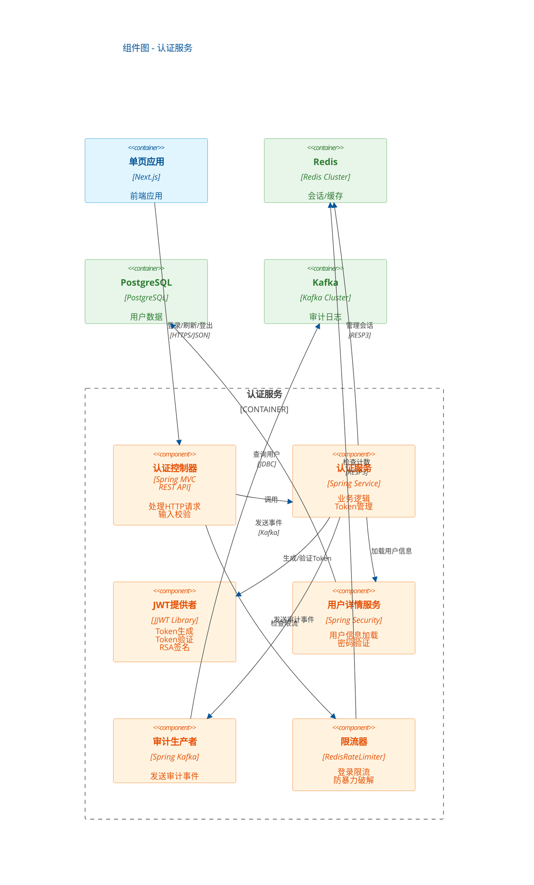
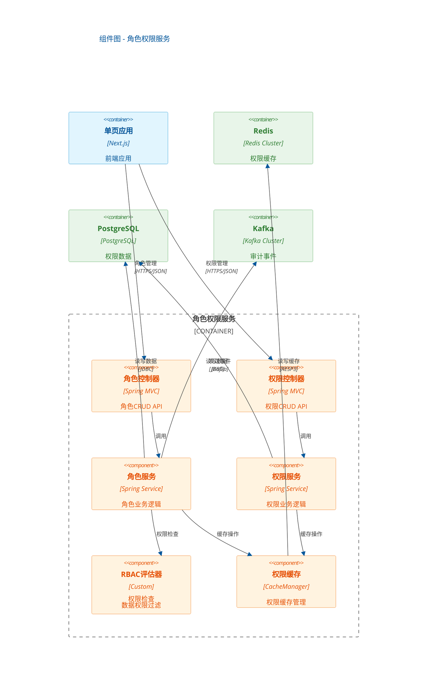

# 组件图

使用 C4 模型 Level 3: Component Diagram

---

## 说明

### 认证服务组件

| 组件 | 类型 | 职责 |
|------|------|------|
| 认证控制器 | Controller | 接收HTTP请求，参数校验，调用服务 |
| 认证服务 | Service | 业务逻辑，协调各组件 |
| JWT提供者 | Component | Token生成、验证、签名 |
| 用户详情服务 | Service | 集成Spring Security，加载用户信息 |
| 审计生产者 | Component | 发送审计事件到Kafka |
| 限流器 | Component | Redis-based限流，防暴力破解 |

### 角色权限服务组件

| 组件 | 类型 | 职责 |
|------|------|------|
| 角色控制器 | Controller | 角色CRUD API |
| 权限控制器 | Controller | 权限CRUD API |
| 角色服务 | Service | 角色业务逻辑 |
| 权限服务 | Service | 权限业务逻辑 |
| RBAC评估器 | Component | 权限检查，数据权限过滤 |
| 权限缓存 | Component | 权限缓存管理 |

---

## 变更记录

| 版本 | 日期 | 修改人 | 修改内容 |
|------|------|--------|----------|
| 1.0 | 2026-03-24 | 系统架构师 | 初始版本 |
