# 容器图

使用 C4 模型 Level 2: Container Diagram

```mermaid
%%{init: {'theme': 'base', 'themeVariables': { 'primaryColor': '#e1f5fe', 'primaryTextColor': '#01579b', 'primaryBorderColor': '#0288d1', 'lineColor': '#0288d1', 'secondaryColor': '#fff3e0', 'tertiaryColor': '#e8f5e9'}}}%%
C4Container
    title 容器图 - 用户角色权限管理系统

    Person(user, "用户", "终端用户/管理员/审计员")

    Container_Boundary(browser, "客户端") {
        Container(spa, "单页应用", "Next.js 16<br/>TypeScript<br/>shadcn/ui", "提供用户界面")
    }

    Container_Boundary(api, "API层") {
        Container(apiGateway, "API网关", "Nginx<br/>Ingress Controller", "路由、负载均衡<br/>限流、SSL终止")
        Container(authService, "认证服务", "Spring Boot<br/>Java 21", "JWT认证<br/>OAuth2集成<br/>会话管理")
        Container(userService, "用户服务", "Spring Boot<br/>Java 21", "用户CRUD<br/>批量导入导出")
        Container(roleService, "角色权限服务", "Spring Boot<br/>Java 21", "角色管理<br/>权限管理<br/>RBAC校验")
        Container(deptService, "部门服务", "Spring Boot<br/>Java 21", "部门树管理<br/>组织架构")
        Container(auditService, "审计服务", "Spring Boot<br/>Java 21", "审计日志记录<br/>日志查询导出")
    }

    Container_Boundary(data, "数据层") {
        ContainerDb(postgres, "PostgreSQL", "PostgreSQL 15<br/>主从集群", "用户数据<br/>角色权限<br/>部门数据")
        ContainerDb(redis, "Redis", "Redis 7<br/>Cluster模式", "会话缓存<br/>权限缓存<br/>限流计数")
        ContainerDb(kafka, "Kafka", "Kafka 3<br/>3节点集群", "审计日志<br/>事件流")
        ContainerDb(minio, "对象存储", "MinIO<br/>(可选)", "文件存储<br/>头像/导入文件")
    }

    Rel(user, spa, "使用", "HTTPS")
    Rel(spa, apiGateway, "API调用", "HTTPS/JSON")

    Rel(apiGateway, authService, "路由", "HTTP")
    Rel(apiGateway, userService, "路由", "HTTP")
    Rel(apiGateway, roleService, "路由", "HTTP")
    Rel(apiGateway, deptService, "路由", "HTTP")
    Rel(apiGateway, auditService, "路由", "HTTP")

    Rel(authService, redis, "会话/Token", "RESP3")
    Rel(authService, postgres, "读写用户数据", "JDBC/SSL")

    Rel(userService, postgres, "读写用户数据", "JDBC/SSL")
    Rel(userService, redis, "缓存", "RESP3")

    Rel(roleService, postgres, "读写权限数据", "JDBC/SSL")
    Rel(roleService, redis, "权限缓存", "RESP3")

    Rel(deptService, postgres, "读写部门数据", "JDBC/SSL")
    Rel(deptService, redis, "部门树缓存", "RESP3")

    Rel(auditService, kafka, "发送审计事件", "Kafka Protocol")
    Rel(auditService, postgres, "读取审计数据", "JDBC/SSL")

    Rel(userService, kafka, "发送用户事件", "Kafka Protocol")
    Rel(roleService, kafka, "发送权限事件", "Kafka Protocol")
    Rel(deptService, kafka, "发送部门事件", "Kafka Protocol")

    Rel(userService, minio, "文件上传/下载", "S3 API")

    UpdateElementStyle(user, $fontColor="#01579b", $bgColor="#e1f5fe", $borderColor="#0288d1")
    UpdateElementStyle(spa, $fontColor="#e65100", $bgColor="#fff3e0", $borderColor="#ef6c00")
    UpdateElementStyle(apiGateway, $fontColor="#e65100", $bgColor="#fff3e0", $borderColor="#ef6c00")
    UpdateElementStyle(authService, $fontColor="#e65100", $bgColor="#fff3e0", $borderColor="#ef6c00")
    UpdateElementStyle(userService, $fontColor="#e65100", $bgColor="#fff3e0", $borderColor="#ef6c00")
    UpdateElementStyle(roleService, $fontColor="#e65100", $bgColor="#fff3e0", $borderColor="#ef6c00")
    UpdateElementStyle(deptService, $fontColor="#e65100", $bgColor="#fff3e0", $borderColor="#ef6c00")
    UpdateElementStyle(auditService, $fontColor="#e65100", $bgColor="#fff3e0", $borderColor="#ef6c00")
    UpdateElementStyle(postgres, $fontColor="#2e7d32", $bgColor="#e8f5e9", $borderColor="#43a047")
    UpdateElementStyle(redis, $fontColor="#2e7d32", $bgColor="#e8f5e9", $borderColor="#43a047")
    UpdateElementStyle(kafka, $fontColor="#2e7d32", $bgColor="#e8f5e9", $borderColor="#43a047")
    UpdateElementStyle(minio, $fontColor="#2e7d32", $bgColor="#e8f5e9", $borderColor="#43a047")
```

## 说明

### 容器职责

| 容器 | 技术 | 主要职责 |
|------|------|----------|
| 单页应用 | Next.js 16 | 用户界面，与后端API交互 |
| API网关 | Nginx/Ingress | 路由、负载均衡、限流、SSL终止 |
| 认证服务 | Spring Boot | JWT认证、OAuth2集成、会话管理 |
| 用户服务 | Spring Boot | 用户CRUD、批量导入导出、用户状态管理 |
| 角色权限服务 | Spring Boot | 角色管理、权限管理、RBAC校验 |
| 部门服务 | Spring Boot | 部门树管理、组织架构维护 |
| 审计服务 | Spring Boot | 审计日志记录、查询、导出 |

### 数据存储

| 存储 | 技术 | 用途 |
|------|------|------|
| PostgreSQL | PostgreSQL 15 主从 | 持久化存储用户、角色、部门、审计数据 |
| Redis | Redis 7 Cluster | 分布式缓存、会话存储、限流计数 |
| Kafka | Kafka 3 集群 | 异步处理审计日志、事件流 |
| MinIO | MinIO | 文件存储（头像、导入导出文件） |

### 通信协议

| 通信 | 协议 | 说明 |
|------|------|------|
| 客户端-服务端 | HTTPS/JSON | REST API |
| 服务间调用 | HTTP/JSON | 内部服务通信 |
| 服务-PostgreSQL | JDBC over SSL | 数据库访问 |
| 服务-Redis | RESP3 over SSL | 缓存访问 |
| 服务-Kafka | Kafka Protocol | 消息队列 |

---

## 变更记录

| 版本 | 日期 | 修改人 | 修改内容 |
|------|------|--------|----------|
| 1.0 | 2026-03-24 | 系统架构师 | 初始版本 |
