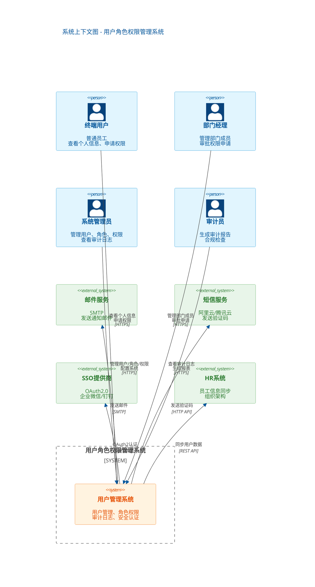

# 系统上下文图

使用 C4 模型 Level 1: System Context Diagram

## 说明

### 用户角色

| 角色 | 描述 | 主要职责 |
|------|------|----------|
| 终端用户 | 普通员工 | 查看/修改个人信息，查看权限，申请权限 |
| 部门经理 | 团队负责人 | 查看部门成员，审批权限申请 |
| 系统管理员 | IT运维人员 | 用户CRUD，角色权限配置，系统配置 |
| 审计员 | 合规人员 | 查看审计日志，生成报表，合规检查 |

### 外部系统

| 系统 | 类型 | 集成方式 | 用途 |
|------|------|----------|------|
| 邮件服务 | SMTP | SMTP协议 | 发送激活邮件、通知邮件 |
| 短信服务 | HTTP API | REST API | 发送2FA验证码 |
| SSO提供商 | OAuth2.0 | HTTPS | 企业微信/钉钉单点登录 |
| HR系统 | REST API | HTTPS | 员工信息同步 |

### 技术约束

- 所有外部通信使用 HTTPS/TLS 1.3
- SSO集成遵循 OAuth2.0 标准
- 邮件服务支持 SMTP 协议
- HR系统集成使用 REST API + JWT

---

## 变更记录

| 版本 | 日期 | 修改人 | 修改内容 |
|------|------|--------|----------|
| 1.0 | 2026-03-24 | 系统架构师 | 初始版本 |
